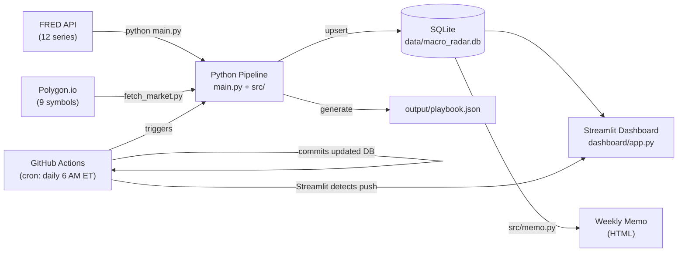
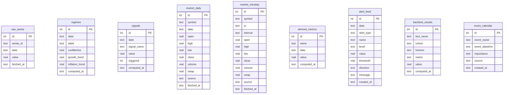

# Macro Regime Radar

**Automated macro regime classification, signal detection, and trader-ready analytics — refreshed daily.**

---

> **Live App:** *[Macro Regime Radar Live](https://macro-regime-radar.streamlit.app/)*


<!-- Replace with actual screenshot after Streamlit deploy -->

---

## What It Does

Macro Regime Radar ingests 12 FRED macroeconomic series and 9 equity/rates/commodity symbols
from Polygon.io, classifies the current macro regime (Goldilocks, Overheating, Stagflation,
or Recession Risk), and generates a suite of trader-facing analytics: signal detection,
backtest results, alert feeds, breakeven/real-yield decompositions, and a full regime playbook.
A 7-tab Streamlit dashboard surfaces all of this in real time. GitHub Actions runs a daily
pipeline at 6 AM ET, commits the updated SQLite database, and Streamlit Cloud auto-redeploys —
no manual intervention required.

---

## Architecture



---

## Features

- **Regime classification** — classifies each month into one of four macro regimes with a confidence score
- **Signal detection** — five alert types: yield curve inversion, unemployment spike, CPI hot/cold, VIX spike
- **Interactive Streamlit dashboard** — seven tabs covering Decision View, Market Snapshot, Macro, Backtests, Alerts, What's Priced, and Calendar
- **Weekly memo generator** — 13-section HTML report with charts for portfolio teams
- **Market data integration** — daily OHLCV bars and intraday 5m bars via Polygon.io
- **Macro surprise engine** — rolling z-scores for all series, surfaced as a ranked surprise table
- **Backtesting engine** — forward SPY returns conditioned on signal triggers and regime entries across 1M/3M/6M/12M horizons
- **Alert feed** — severity-tiered (risk/watch/info) alerts from both macro signals and market z-scores
- **What's Priced** — live policy rates, breakeven inflation, and TIPS real yields with MoM changes
- **Automated daily data refresh** — GitHub Actions cron pipeline, zero manual intervention

---

## Data Sources

### FRED (Federal Reserve Economic Data)

| Series ID | Description |
|-----------|-------------|
| `INDPRO` | Industrial Production Index (monthly) |
| `CPIAUCSL` | CPI All Urban Consumers (monthly) |
| `GS10` | 10-Year Treasury Constant Maturity Rate |
| `GS2` | 2-Year Treasury Constant Maturity Rate |
| `UNRATE` | Unemployment Rate (monthly) |
| `VIXCLS` | CBOE Volatility Index (daily → resampled monthly) |
| `FEDFUNDS` | Federal Funds Effective Rate (monthly) |
| `SOFR` | Secured Overnight Financing Rate (daily → monthly) |
| `T5YIE` | 5-Year Breakeven Inflation Rate |
| `T10YIE` | 10-Year Breakeven Inflation Rate |
| `DFII5` | 5-Year TIPS Yield (Real) |
| `DFII10` | 10-Year TIPS Yield (Real) |

### Polygon.io

| Symbol | Asset Class | Frequency |
|--------|-------------|-----------|
| SPY | US Large Cap Equity | Daily + 5m intraday |
| QQQ | US Tech Equity | Daily + 5m intraday |
| IWM | US Small Cap Equity | Daily |
| TLT | Long-Duration Treasuries | Daily |
| HYG | High Yield Credit | Daily |
| LQD | Investment Grade Credit | Daily |
| UUP | US Dollar Index | Daily |
| GLD | Gold | Daily |
| USO | Oil | Daily |

---

## Database Schema



---

## Example SQL Queries

### 1. Latest Regime Classification

Shows the most recent macro regime label, confidence score, and underlying growth/inflation trends.
Useful for quickly understanding the current macro environment without reading the full dashboard.

```sql
SELECT date, label, confidence, growth_trend, inflation_trend
FROM regimes
ORDER BY date DESC
LIMIT 1;
```

### 2. Top Macro Surprises by Z-Score

Ranks all macro and market series by the magnitude of their latest rolling z-score. A z-score
above ±2.5σ indicates an extreme deviation from recent history — the most actionable surprises.

```sql
SELECT dm.name, dm.date, dm.value AS z_score
FROM derived_metrics dm
WHERE dm.name LIKE '%_z'
  AND dm.date = (
    SELECT MAX(date)
    FROM derived_metrics dm2
    WHERE dm2.name = dm.name
  )
ORDER BY ABS(dm.value) DESC
LIMIT 10;
```

### 3. Latest Signals Snapshot

Returns all five macro signal readings as of the most recent date, ordered by triggered status.
Shows which signals are currently firing and what their underlying values are.

```sql
SELECT date, signal_name, value, triggered
FROM signals
WHERE date = (SELECT MAX(date) FROM signals)
ORDER BY triggered DESC, signal_name ASC;
```

### 4. Recent Alerts Feed

Returns the 25 most recent alerts sorted by severity. Covers both macro signal alerts (from
the signals table) and market alerts (from derived_metrics z-scores).

```sql
SELECT date, level, alert_type, name, value, threshold, direction, message
FROM alert_feed
ORDER BY date DESC, created_at DESC
LIMIT 25;
```

### 5. Backtest Results Pivot

Pivots the backtest_results table to show average return, hit rate, and sample size for each
signal/regime cohort across horizons. Reveals which macro signals have historically predicted
strong forward equity returns.

```sql
SELECT
  cohort,
  horizon,
  MAX(CASE WHEN metric = 'avg_return' THEN value END) AS avg_return,
  MAX(CASE WHEN metric = 'hit_rate'   THEN value END) AS hit_rate,
  MAX(CASE WHEN metric = 'n'          THEN value END) AS n
FROM backtest_results
GROUP BY cohort, horizon
ORDER BY horizon, avg_return DESC;
```

---

## Setup

```bash
git clone https://github.com/maxkomen-macro/macro-regime-radar.git
cd macro-regime-radar
python -m venv .venv
source .venv/bin/activate
pip install -r requirements.txt

# Create .env with your API keys
echo 'FRED_API_KEY=your_key_here' > .env
echo 'POLYGON_API_KEY=your_key_here' >> .env

# Run database migrations (creates all tables)
python src/migrate.py

# Build/update the database (FRED fetch + regime + signals)
python main.py

# Fetch market data (first run: use backfill; subsequent: incremental)
python src/market_data/fetch_market.py --mode backfill

# Load economic calendar events
python src/events/load_events.py

# Run analytics suite
python -m src.analytics.surprise
python -m src.analytics.backtest
python -m src.analytics.alerts
python -m src.analytics.priced
python -m src.analytics.playbook

# Launch the dashboard
streamlit run dashboard/app.py
```

---

## Project Structure

```
macro-regime-radar/
├── .github/
│   └── workflows/
│       └── refresh-data.yml   # Daily cron: pipeline → commit updated DB → Streamlit redeploys
├── config/
│   ├── assets.yml             # Polygon.io symbol lists (daily + intraday)
│   └── providers.yml          # API rate limit config
├── dashboard/
│   ├── app.py                 # Main Streamlit app (7 tabs, ~1200 lines)
│   └── components/
│       ├── db_helpers.py      # Cached DB loaders for all Trader Pack tables
│       ├── decision_view.py   # ⚡ Decision View tab — PM scan in 20 seconds
│       ├── market_snapshot.py # 📊 Market Snapshot tab — rates bar + watchlist
│       ├── backtests.py       # 🧪 Backtests tab — signal/regime forward returns
│       ├── alerts_tab.py      # 🚨 Alerts tab — severity-filtered feed
│       ├── whats_priced.py    # 💲 What's Priced tab — policy rates + breakevens
│       ├── calendar_tab.py    # 📅 Calendar tab — events + "What to Watch Next"
│       └── tradingview.py     # TradingView widget embeds
├── data/
│   └── macro_radar.db         # SQLite database (committed; auto-updated by GHA)
├── docs/
│   ├── DEPLOY_STREAMLIT.md    # Step-by-step Streamlit Cloud deployment guide
│   └── images/
│       └── dashboard.png      # Dashboard screenshot (add after deploy)
├── events/
│   └── calendar.csv           # Economic calendar events CSV
├── output/
│   └── playbook.json          # Regime playbook (generated by analytics/playbook.py)
├── src/
│   ├── config.py              # FRED series, paths, thresholds
│   ├── database.py            # DB init (CREATE TABLE IF NOT EXISTS)
│   ├── fetch_data.py          # FRED fetch → raw_series upsert
│   ├── regime.py              # Regime classification logic
│   ├── signals.py             # Signal detection logic
│   ├── memo.py                # Weekly HTML memo generator
│   ├── migrate.py             # Trader Pack table migrations
│   ├── analytics/
│   │   ├── surprise.py        # Weekly z-score surprise metrics → derived_metrics
│   │   ├── backtest.py        # Signal/regime → forward SPY returns → backtest_results
│   │   ├── alerts.py          # Macro + market alerts → alert_feed
│   │   ├── priced.py          # Policy rates, breakevens, TIPS → derived_metrics
│   │   └── playbook.py        # Regime playbook text → output/playbook.json
│   ├── events/
│   │   └── load_events.py     # Load events/calendar.csv → event_calendar
│   ├── market_data/
│   │   ├── fetch_market.py    # Polygon.io fetch → market_daily / market_intraday
│   │   ├── polygon.py         # Polygon API client
│   │   └── base.py            # Abstract market data provider
│   └── utils/
│       ├── db.py              # get_connection() helper
│       ├── dates.py           # Date window helpers
│       └── fred_client.py     # FRED API fetch helper
├── .streamlit/
│   ├── config.toml            # Dark theme + headless server config
│   └── secrets.toml.example   # API key template (do not commit secrets.toml)
├── .gitignore
├── main.py                    # Pipeline entry point: FRED → regimes → signals
├── requirements.txt
└── runtime.txt                # Streamlit Cloud Python version pin
```

---

## Tech Stack

**Python** | **SQLite** | **Streamlit** | **pandas** | **NumPy** | **Plotly** | **Matplotlib** | **FRED API** | **Polygon.io** | **GitHub Actions** | **Jinja2**
