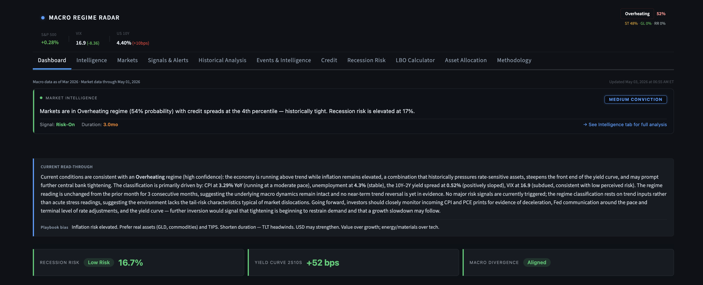
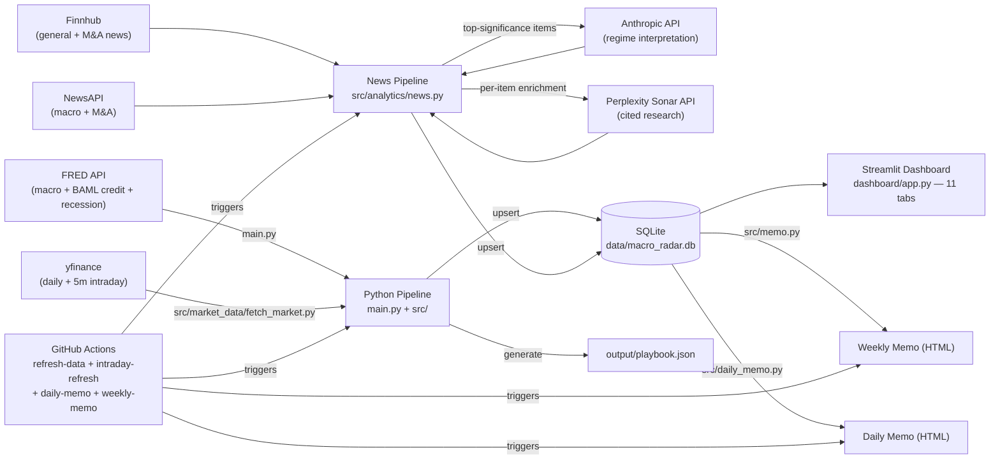

# Macro Regime Radar

**A Bloomberg-terminal-style quantitative macro platform — regime classification, recession modeling, portfolio optimization, LBO analysis, and AI-augmented news intelligence across 11 interactive tabs. Refreshed automatically; zero manual intervention.**

---

> **Live App:** *[Macro Regime Radar Live](https://macro-regime-radar.streamlit.app/)*



---

## What It Does

Macro Regime Radar ingests macroeconomic time series from FRED, equity / rates / commodity prices from yfinance, and breaking financial headlines from Finnhub and NewsAPI. It then runs a stack of quantitative models on top of that data:

- A **4-way macro regime classifier** (Goldilocks, Overheating, Stagflation, Recession Risk) using a temperature-scaled softmax over growth and inflation trends, persisting daily probabilities for each regime
- A **recession probability model** trained on NBER recession dates via logistic regression, surfaced through an interactive gauge with sensitivity sliders and a divergence indicator versus the yield curve signal
- A **credit conditions module** tracking BAML OAS spreads (IG, HY, BB, B, CCC), the 30-year Treasury, LBO all-in cost, regime-conditional credit performance, percentile ranks, and Markov transition matrices (3-month and 6-month)
- A **portfolio optimization suite** with five methods (Mean-Variance, Min Variance, Risk Parity, Black-Litterman, Hierarchical Risk Parity), CVaR / Expected Shortfall, factor decomposition (Value / Momentum / Quality / Size / LowVol), Fama-French factor data via openbb, and currency overlays
- An **LBO calculator** modeling capital structure, debt schedules, exit multiples, and IRR (computed via binary search on NPV — `numpy.irr` is gone in modern numpy)
- A **news intelligence pipeline** with significance scoring across five dimensions (market impact, deal size, sector relevance, time sensitivity, regime relevance); top-significance items receive an AI interpretation pass via the Anthropic API and a per-item cited-research enrichment via the Perplexity Sonar API, both persisted into the database and rendered in the Events & Intelligence tab and the daily memo

The whole platform refreshes automatically: a daily GitHub Actions cron rebuilds the macro pipeline, an intraday cron updates market prices every five minutes during market hours, a daily cron generates the daily memo, and a weekly cron generates the full HTML weekly memo. Streamlit Community Cloud auto-redeploys on every push. No manual data refreshes, no missed updates.

The data-writing workflows share a `data-write` concurrency group and use a soft-reset retry loop to prevent SQLite binary conflicts during scheduled runs.

Built as a recruiting portfolio piece — every model is documented in the in-app Methodology tab, and the underlying SQL is queryable from the included examples below.

---

## Architecture



---

## Dashboard Tabs

| # | Tab | Purpose |
|---|-----|---------|
| 1 | Dashboard | Top-level summary — regime card, recession probability card, key signals |
| 2 | Intelligence | Macro narrative + AI commentary |
| 3 | Markets | Live market snapshot, intraday auto-refresh during market hours |
| 4 | Signals & Alerts | Signal cards with threshold-ratio fill bars |
| 5 | Historical Analysis | Backtests, regime history, Markov transition matrices |
| 6 | Events & Intelligence | Economic calendar + news reader (Finnhub + NewsAPI + Anthropic + Perplexity) |
| 7 | Credit | BAML OAS spreads, 30yr UST, LBO all-in cost, regime performance, transition matrices |
| 8 | Recession Risk | Logistic regression model, SVG gauge, yield curve monitor, sensitivity sliders |
| 9 | LBO Calculator | Capital structure modeling with IRR via binary search |
| 10 | Asset Allocation | 5 optimization methods, CVaR, factor decomposition, currency overlay |
| 11 | Methodology | Written documentation of every model and signal |

---

## Features

- **Regime classification** — temperature-scaled softmax classifier producing daily probabilities across four macro regimes
- **Recession modeling** — scikit-learn logistic regression trained on NBER recession dates, with feature sensitivity sliders and a divergence indicator versus the yield curve signal
- **Portfolio optimization** — five methods (MVO, Min Var, Risk Parity, Black-Litterman, HRP) with CVaR / Expected Shortfall risk metrics, regime-conditional return estimation, and factor decomposition
- **Credit analytics** — IG, HY, BB, B, CCC OAS spreads, sparklines, percentile ranks, regime performance tables, 3-month and 6-month Markov transition matrices, all-in LBO cost tracker
- **LBO modeling** — full capital structure modeling with debt schedules, exit assumptions, and IRR via binary search on NPV
- **News intelligence** — Finnhub + NewsAPI ingest, significance scoring across five dimensions (market impact, deal size, sector relevance, time sensitivity, regime relevance), AI regime interpretation via Anthropic for top-significance items
- **Cited-research enrichment** — every high-significance news item is also routed through the Perplexity Sonar API to retrieve cited, real-time research context. Output is stored in `news_feed.perplexity_research` and rendered in both the Events & Intelligence tab and the daily memo
- **Macro surprise engine** — rolling z-scores normalize signals across series with vastly different scales
- **Backtesting engine** — forward returns conditioned on signal triggers and regime entries across 1M / 3M / 6M / 12M horizons
- **Live market snapshot** — `st.fragment(run_every=30)` for 30-second auto-refresh during market hours; daily and intraday tickers configured in `config/assets.yml`
- **Daily and weekly HTML memos** — fully automated; daily memo via `src/daily_memo.py`, weekly memo via `src/memo.py`
- **Bloomberg dark aesthetic** — every component built with a consistent dark color system (`#0d1117` background, `#161b22` cards, `#30363d` borders, `#4a9eff` accent)
- **Four automated workflows** — daily macro refresh, intraday refresh during market hours, daily memo generation, weekly memo generation. Both DB-writing workflows share a `data-write` concurrency group and use a soft-reset retry loop to prevent SQLite binary conflicts

---

## Data Sources

### FRED (Federal Reserve Economic Data)

| Series ID | Description |
|-----------|-------------|
| `INDPRO` | Industrial Production Index |
| `CPIAUCSL` | CPI All Urban Consumers |
| `DGS10` | 10-Year Treasury Constant Maturity Rate (daily) |
| `DGS2` | 2-Year Treasury Constant Maturity Rate (daily) |
| `UNRATE` | Unemployment Rate |
| `VIXCLS` | CBOE Volatility Index |
| `FEDFUNDS` | Federal Funds Effective Rate |
| `SOFR` | Secured Overnight Financing Rate |
| `T5YIE` | 5-Year Breakeven Inflation Rate |
| `T10YIE` | 10-Year Breakeven Inflation Rate |
| `DFII5` | 5-Year TIPS Yield (Real) |
| `DFII10` | 10-Year TIPS Yield (Real) |
| `BAMLC0A0CM` | ICE BofA US Investment Grade Corporate Index OAS |
| `BAMLH0A0HYM2` | ICE BofA US High Yield Index OAS |
| `BAMLH0A1HYBB` | ICE BofA BB US High Yield Index OAS |
| `BAMLH0A2HYB` | ICE BofA Single-B US High Yield Index OAS |
| `BAMLH0A3HYC` | ICE BofA CCC and Lower US High Yield Index OAS |
| `USREC` | NBER Recession Indicator (binary) |
| `USSLIND` | Leading Index for the United States — historical only |

Notes on FRED series choices:

- **Yields use daily series** (`DGS2`, `DGS10`), not monthly averages (`GS2`, `GS10`)
- **IG OAS** uses `BAMLC0A0CM`, not `BAMLC0A0CAAA`
- **`USSLIND` is a frozen historical series.** FRED stopped publishing it in February 2020. The local DB has 288 rows ending `2020-02-01` and that is all the data that will ever exist. The series is preserved in config because the recession model uses it as historical training data; live recession signal computation uses `T10YIE − T5YIE` breakeven as the operative input.

### yfinance (Equity, Rates, Commodity Prices)

`yfinance` (keyless) supplies both daily OHLCV bars for the full tracked universe and 5-minute intraday bars during market hours. Polygon.io was the original source and was replaced with yfinance pre-Phase 7 to remove the API-key dependency. Full ticker lists live in `config/assets.yml`.

**Daily universe (23 tickers):**

| Category | Tickers |
|----------|---------|
| US equity broad | SPY, QQQ, IWM |
| US sector ETFs | XLF, XLE, XLI, XLK |
| Style / international | VTV, EFA, EEM |
| Treasuries | TLT, IEF, SHY |
| Credit | HYG, LQD, EMB |
| Commodities | GLD, SLV, USO, UNG, CPER |
| Currency / vol | UUP, VIXY |

**Intraday universe (7 tickers):** SPY, QQQ, IWM, TLT, GLD, UUP, VIXY

### Finnhub & NewsAPI (News Intelligence)

- **Finnhub** — market news with company tagging, used for M&A and earnings signal extraction
- **NewsAPI** — broader macro and geopolitical headlines

Both are accessed via raw `requests` calls in `src/analytics/news.py`. Headlines are scored on five significance dimensions; top-significance items trigger downstream AI passes.

### Anthropic API (Claude)

The news pipeline calls Claude for top-significance headlines to produce a regime-aware interpretation: what the news implies for the current macro regime and which signals it might move. Output is persisted in `news_feed.regime_interpretation` and rendered alongside the headline in the Events & Intelligence tab and the daily memo.

### Perplexity Sonar API

Per-item cited research enrichment. After significance scoring, qualifying news items are routed to the Perplexity Sonar API, which returns a citation-rich research summary. Output is persisted in `news_feed.perplexity_research` and rendered alongside the Anthropic interpretation. This means each high-significance headline ships with both an AI-generated regime interpretation AND a citation-backed research context.

---

## Database Schema

```mermaid
erDiagram
    raw_series {
        int id PK
        text series_id
        text date
        real value
        text fetched_at
    }
    regimes {
        int id PK
        text date
        text label
        real confidence
        real growth_trend
        real inflation_trend
        text computed_at
        real prob_goldilocks
        real prob_overheating
        real prob_stagflation
        real prob_recession
    }
    signals {
        int id PK
        text date
        text signal_name
        real value
        int triggered
        text computed_at
    }
    market_daily {
        int id PK
        text symbol
        text date
        real open
        real high
        real low
        real close
        real volume
        real vwap
        text source
        text fetched_at
    }
    market_intraday {
        int id PK
        text symbol
        text ts
        text interval
        real open
        real high
        real low
        real close
        real volume
        real vwap
        text source
        text fetched_at
    }
    derived_metrics {
        int id PK
        text name
        text date
        real value
        text computed_at
    }
    alert_feed {
        int id PK
        text date
        text alert_type
        text name
        text level
        real value
        real threshold
        text direction
        text message
        text created_at
    }
    backtest_results {
        int id PK
        text test_name
        text cohort
        text horizon
        text metric
        real value
        text computed_at
    }
    event_calendar {
        int id PK
        text event_name
        text event_datetime
        text importance
        text source
        text created_at
    }
    news_feed {
        int id PK
        text headline
        text summary
        text url
        text source
        text category
        datetime published_at
        datetime fetched_at
        int market_impact
        int deal_size
        int sector_relevance
        int time_sensitivity
        int regime_relevance
        real overall_significance
        text regime_interpretation
        text ticker
        text perplexity_research
    }
    factor_data {
        int id PK
        text date
        real mkt_rf
        real smb
        real hml
        real rmw
        real cma
        real rf
        text source
        text fetched_at
    }
```



For the authoritative live schema, run:

```bash
sqlite3 data/macro_radar.db ".schema"
```

> **Note on `market_intraday.vwap`:** the column is populated for legacy Polygon-era rows but is NULL for current yfinance rows (yfinance does not natively provide VWAP). The column is retained for back-compatibility.

---

## Example SQL Queries

### 1. Latest Regime Classification

The most recent macro regime label, confidence score, underlying growth/inflation trends, and the four softmax probabilities.

```sql
SELECT date, label, confidence,
       prob_goldilocks, prob_overheating, prob_stagflation, prob_recession
FROM regimes
ORDER BY date DESC
LIMIT 1;
```

### 2. Recession Regime Probability Trend (Last 12 Months)

The `prob_recession` softmax probability from the regime classifier, day-over-day. Useful for spotting inflections in the model's view of recession risk.

```sql
SELECT date, prob_recession
FROM regimes
ORDER BY date DESC
LIMIT 12;
```

### 3. Top Macro Surprises by Z-Score

All series ranked by the magnitude of their latest rolling z-score. Above ±2.5σ indicates extreme deviation from recent history.

```sql
SELECT dm.name, dm.date, dm.value AS z_score
FROM derived_metrics dm
WHERE dm.name LIKE '%_z'
  AND dm.date = (
    SELECT MAX(date)
    FROM derived_metrics dm2
    WHERE dm2.name = dm.name
  )
ORDER BY ABS(dm.value) DESC
LIMIT 10;
```

### 4. Latest High-Significance Headlines with AI Interpretation and Research

Headlines scoring 4 or higher on overall significance (a weighted aggregate of five dimensions: market impact, deal size, sector relevance, time sensitivity, regime relevance), with both the AI-generated regime interpretation and the Perplexity-cited research attached.

```sql
SELECT published_at, source, headline, overall_significance,
       regime_interpretation, perplexity_research
FROM news_feed
WHERE overall_significance >= 4
ORDER BY published_at DESC
LIMIT 10;
```

### 5. Latest Signals Snapshot

All current signal readings with triggered status, ordered by triggered first.

```sql
SELECT date, signal_name, value, triggered
FROM signals
WHERE date = (SELECT MAX(date) FROM signals)
ORDER BY triggered DESC, signal_name ASC;
```

### 6. Backtest Results Pivot

Average return, hit rate, and sample size for each signal/regime cohort across horizons.

```sql
SELECT
  cohort,
  horizon,
  MAX(CASE WHEN metric = 'avg_return' THEN value END) AS avg_return,
  MAX(CASE WHEN metric = 'hit_rate'   THEN value END) AS hit_rate,
  MAX(CASE WHEN metric = 'n'          THEN value END) AS n
FROM backtest_results
GROUP BY cohort, horizon
ORDER BY horizon, avg_return DESC;
```

---

## Setup

```bash
git clone https://github.com/maxkomen-macro/regime-radar.git
cd macro-regime-radar
python -m venv .venv
source .venv/bin/activate
pip install -r requirements.txt

# Configure secrets — copy and fill in API keys
cp .streamlit/secrets.toml.example .streamlit/secrets.toml
# Required: FRED_API_KEY
# Optional Phase-11 (news + AI): FINNHUB_API_KEY, NEWS_API_KEY, ANTHROPIC_API_KEY, PERPLEXITY_API_KEY
# Legacy: POLYGON_API_KEY (yfinance is the active market data source)

# Initialize the database
python src/migrate.py

# Run the full daily pipeline (FRED fetch + regime + signals + analytics)
python main.py

# Fetch market data (uses yfinance — no API key required)
python -m src.market_data.fetch_market

# Refresh news intelligence (requires Finnhub + NewsAPI + Anthropic + Perplexity keys)
python -m src.analytics.news

# Launch the dashboard
streamlit run dashboard/app.py
```

For an intraday-only market refresh (mirrors the GitHub Actions intraday workflow):

```bash
python -m src.market_data.fetch_market --mode intraday-only
```

---

## Project Structure

```
macro-regime-radar/
├── .github/
│   └── workflows/
│       ├── refresh-data.yml       # Daily macro pipeline + DB push
│       ├── intraday-refresh.yml   # 5-min market refresh, market hours only
│       ├── daily-memo.yml         # Daily HTML memo
│       └── weekly-memo.yml        # Weekly HTML memo
├── config/
│   ├── assets.yml                 # yfinance ticker lists (daily + intraday)
│   └── providers.yml              # API rate limit config
├── dashboard/
│   ├── app.py                     # Streamlit entry point, 11-tab routing (~67 KB)
│   └── components/                # ~18 component files: events_tab, intelligence_tab,
│                                  # credit_tab, recession_tab, lbo_tab, allocation_tab,
│                                  # market_snapshot, methodology, etc.
├── src/
│   ├── analytics/                 # Signal/regime/optimization/news logic
│   │   ├── credit.py
│   │   ├── recession.py           # Logistic regression on NBER dates
│   │   ├── allocation.py          # 5 optimization methods + CVaR + factors
│   │   ├── lbo.py                 # IRR via binary search on NPV
│   │   ├── news.py                # Finnhub + NewsAPI + Anthropic interpretation
│   │   ├── perplexity.py          # Sonar API cited-research enrichment
│   │   ├── intelligence.py
│   │   ├── volatility.py          # ARCH/GARCH models
│   │   ├── surprise.py            # Z-score signal scoring
│   │   ├── backtest.py            # Signal/regime forward returns
│   │   ├── alerts.py
│   │   ├── playbook.py
│   │   └── priced.py
│   ├── market_data/
│   │   ├── fetch_market.py        # yfinance daily + intraday OHLCV
│   │   ├── yfinance_client.py
│   │   ├── backfill_yfinance.py
│   │   ├── polygon.py             # Legacy — yfinance is the active path
│   │   └── base.py
│   ├── events/
│   │   └── load_events.py
│   ├── utils/
│   │   ├── db.py
│   │   ├── dates.py
│   │   └── fred_client.py
│   ├── config.py                  # FRED series, ticker lists, thresholds
│   ├── database.py                # DB initialization
│   ├── db_helpers.py              # Schema migrations (ALTER TABLE)
│   ├── fetch_data.py              # FRED → raw_series upsert
│   ├── regime.py                  # 4-way softmax regime classifier
│   ├── signals.py                 # Signal detection logic
│   ├── memo.py                    # Weekly HTML memo
│   ├── daily_memo.py              # Daily HTML memo
│   └── migrate.py                 # Initial schema migrations
├── data/
│   └── macro_radar.db             # SQLite (excluded from local git tracking)
├── docs/
│   └── images/dashboard.png
├── output/
│   └── playbook.json
├── events/
│   └── calendar.csv
├── .streamlit/
│   ├── config.toml                # Dark theme + headless server config
│   └── secrets.toml.example       # API key template
├── main.py                        # Pipeline entry point
├── CLAUDE.md                      # Internal reference for Claude Code sessions
├── requirements.txt
└── runtime.txt                    # Streamlit Cloud Python version pin
```

---

## Tech Stack

**Python 3.12** | **Streamlit** | **SQLite** | **pandas** | **NumPy** | **scikit-learn** | **Plotly** | **Altair** | **Matplotlib** | **arch** | **riskfolio-lib** | **quantstats** | **pyfolio-reloaded** | **prophet** | **openbb** | **FRED API** | **yfinance** | **Finnhub** | **NewsAPI** | **Anthropic API** | **Perplexity Sonar API** | **Jinja2** | **GitHub Actions** | **Streamlit Community Cloud**