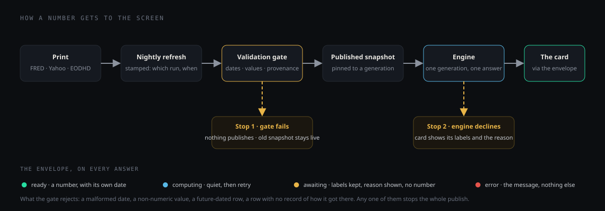
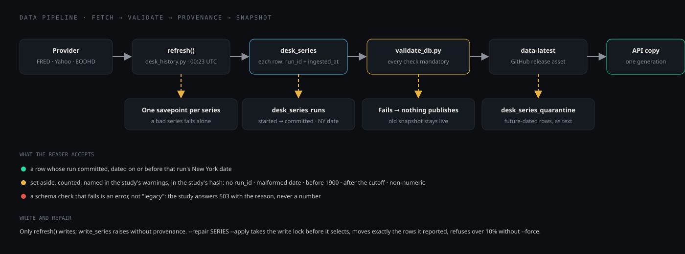
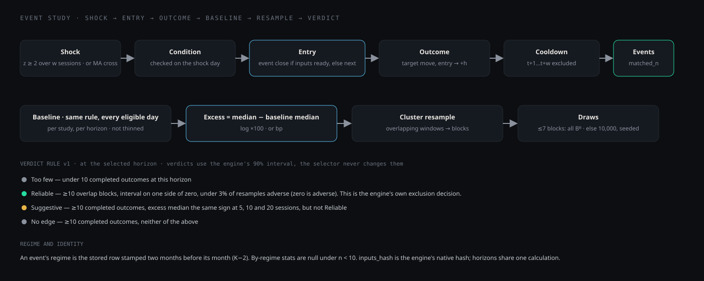
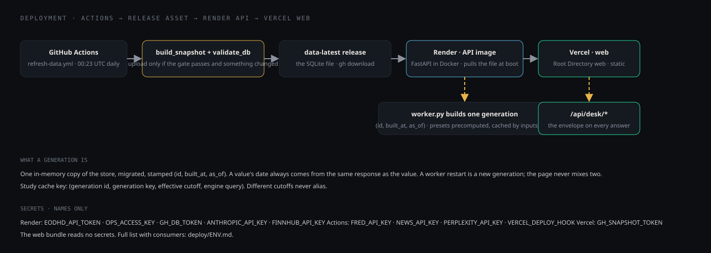
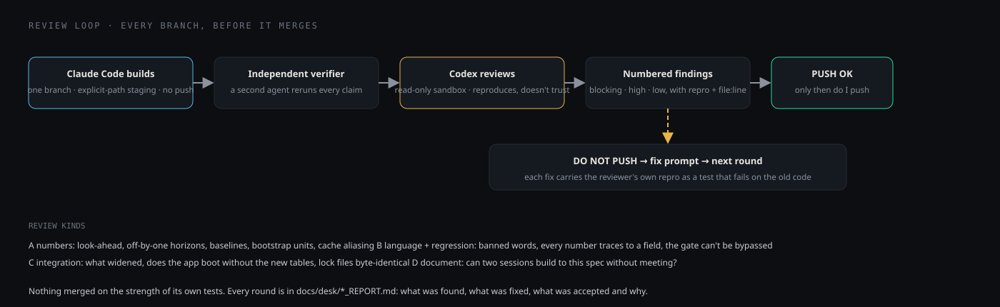

# Build Notes

Max Komen · September 2026

## What this is

Desk is the analyst side of Macro Regime Radar. It answers one kind of
question: when a defined thing happened in the market, what did the market
do next, and is the pattern strong enough to size a trade on? Everything on
the site is either a number the engine produced from stored data, or a
clearly labeled placeholder for something I designed but haven't wired yet.
There is no third category.

I built it because the interview question was about turning a macro view
into a trade, and I wanted to show what that looks like when the work is
checked rather than asserted.

## How a number gets to the screen

Every value on Desk takes the same path. A FRED or Yahoo print is fetched
nightly and written with a record of which run wrote it and when. A
validation gate reads the whole store before anything is published; a
malformed date, a value that isn't a number, a future-dated row, or a row
with no record of how it got there fails the gate, and a failed gate means
nothing is published. What passes is a snapshot pinned to a generation. The
engine runs against that generation only, so two people looking at the
site see the same calculation. The API wraps every answer in an envelope
that says ready, computing, or awaiting, and a card that gets awaiting
shows its labels and the reason, not a number.

Two things can stop a number on the way. Validation can fail, in which case
the old snapshot stays live. Or the engine can decline, because the data
isn't there or the question isn't one it can answer, in which case the card
says so.

## What the engine does

The event study takes a shock (gold up two standard deviations over twenty
sessions, the S&P's 50-day average crossing its 200-day), an optional
condition (the S&P below its 50-day, a regime), a target, and a horizon.
It finds every session since the sample start where the shock fired,
enters at the close when the inputs were available by then and the next
close otherwise, and measures the target's move over the horizon. Events
inside a shock's own window are excluded so one episode isn't counted
twice. The baseline is the same measurement on every eligible session,
not a fixed number.

The verdict is a rule, not an opinion. Reliable means at least ten
independent episodes, the resampled range on one side of zero, and fewer
than 3% of resamples going the other way. Suggestive means ten or more
completed outcomes leaning the same way out to a month, but the range still
crosses zero. No edge means it was checked and there's nothing there. Too
few means under ten. The resampling clusters overlapping events into
blocks and resamples whole blocks, so a run of events inside one selloff
counts as one piece of evidence, not five.

## What is a model and what isn't

The regime label is a rule: growth rising or falling, inflation rising or
falling, four combinations. No fitting. It lags two months because the
inputs do, and the label that governs a September session is the one
stamped July; the site shows both.

The recession score is the one fitted thing on the site, a logistic
regression of five monthly indicators against NBER recession dates. It is
labeled as a model everywhere it appears, its score is for the month it
was computed for rather than a forecast, and its historical scores are
in-sample. I'd rather show that plainly than dress it up.

Nothing else on the site is fitted.

## What's live, and why the rest isn't yet

Live on the published snapshot: Overview, Technicals (price, averages,
crosses, S&P signals, sector leadership, the 14-day RSI, MACD and its last crossover, seasonality by calendar month), Event Study for the catalog of
questions, Regime (label, history, recession score, next prints, what each
regime has meant since 1996, the last changes), Macro
(curve, credit, the stock–bond correlation, what moves with the S&P, the 12-asset correlation matrix), Sectors (leadership and breadth), Signal Ledger (the two RSI signals included), Position Monitor (in
your browser), the Client view, Data Pipeline, and this page. The sector
ETFs and the other Desk ETFs are stored by the same refresh step as the
S&P's closes, with their volume, full history back to each fund's first
close. Live on request: Basket & Hedge, a basket you keep in your browser
priced as one index from daily closes, read against the Nasdaq and the S&P,
and hedged with the ETF that fits it best.

Designed and drawn, not yet served, each for a stated reason:

- Options and skew: needs a stored history of SPY option snapshots and a
  written method for picking strikes and expiries. A number without that
  isn't auditable, so there isn't one.
- Breadth from the stocks themselves: the Sectors card counts the 11
  sector ETFs above their 50- and 200-day averages and says so on every
  count. Counting the index's own stocks needs constituent data, which the
  store doesn't hold.
- The confidence selector: verdicts are fixed at 90%, so the chips would
  only move the whiskers, and that plumbing isn't built.
- Position Monitor stores positions in your browser. There is no server
  store and no login, and I'm not putting a shared one on a public site.
  The discipline gate in the browser is a workflow check, not a server
  rule.
- Hedging a basket with options: the arithmetic for a beta-adjusted put
  spread on a basket has to be exactly right or absent. It's absent until
  it's right; the card has its slot on the page.

## Prototypes, and how I would build them

Five cards are drawn as prototypes: finished, with illustrative values, each
ending in a small footnote that says so and names how it would be built. They
are there so the Desk can be walked through end to end. They don't change the
list above: nothing in them is served, and each stays designed, not yet
served, until it is. A test holds every prototype value inside its own card,
and no live card reads a prototype's data. Here is how I'd build each one for
real.

**What protection costs right now (Technicals).** Source: the EODHD options
add-on, one snapshot of the SPY chain a day after the close, every strike and
expiry with bid, ask, implied volatility and open interest. Compute: a
versioned method that interpolates the 25-delta put and call at a constant
30-day maturity, the at-the-money term structure at 1, 3 and 6 months,
realized volatility from the stored closes over the same windows, and the
skew's percentile over the stored history. Storage: one row per date, expiry,
strike and right in a raw chain table, plus a small derived table keyed by
date and method version, so a change of method restates the history rather
than patching it. Effort: about two weeks, most of it the method and its
tests; the percentile then needs two years of collected snapshots, or a
purchased backfill.

**Hedge with options (Basket & Hedge).** Source: the same chain snapshots for
the hedge ETF and the basket's largest names, and, for the OTC route, a
dealer's indicative quote entered by hand. Compute: each structure priced off
the stored surface at its own strike and expiry instead of an assumed
volatility; route (a) sized from the basket engine's hedge ratio, with basis
risk shown by its R²; breakeven and the payoff under a 10% fall. Storage: the
quotes with their timestamps, and each priced hedge saved with its basket and
the surface's as-of date. Effort: two to three weeks once the options store
exists, mostly the arithmetic's tests: spreads, dividends, and early exercise
on American single-name options, which Black-Scholes leaves out.

**Positioning (Basket & Hedge).** Source: the exchanges' twice-monthly
short-interest files, OCC's daily open interest by series, and the SEC's
quarterly 13F filings. Compute: short interest over float, days to cover
against 20-day average volume, the put/call open-interest ratio, and a
crowding flag whose thresholds are written down and tested. Storage: one
table per source, each row dated by its settlement or filing date, because
the three arrive on three calendars and the card has to say how old each
figure is. Effort: about two weeks; the 13F parsing is the long pole, and its
45-day lag has to be printed beside the number.

**Event study on this basket (Basket & Hedge).** Source: the closes the
basket's names already have in the store, plus any name not yet ingested.
Compute: a basket index from the saved weights, a name joining when it lists,
rebalanced monthly, then the existing event-study engine run on that series
exactly as it runs on the S&P: same entry rule, baseline, blocks and verdict
rule. Storage: the index levels in the proposed MART.INDEX_LEVELS table, keyed
by basket and date, with the inputs hash. Effort: about a week, since the
engine exists; the work is the index, its rebalancing rule, and a cache keyed
on the basket's weights.

**Sync to Snowflake (Data Pipeline).** Source: the validated SQLite snapshot
the refresh already publishes. Compute: a job after each validated refresh
that stages the changed rows as Parquet, runs MERGE on each RAW and CUR
table's key, builds the MART tables beside the live ones and swaps them in,
then compares counts and HASH_AGG per table with the snapshot and fails the
run on any mismatch. Storage: the three schemas of the proposed DDL, with each
run logged: rows staged, merged and verified. Effort: about a week, plus a
Snowflake account and a key-pair role. The DDL and the CSV export on that
page are already real.

## Review log

Every branch went through independent review before it merged: a second
model reads the code it didn't write, reproduces each claim, and returns
numbered findings. As of the Sep 24 audit the reviews had raised 418 findings in 57
rounds across six branches: 365 fixed, 28 recorded as accepted
exceptions with the reason, 19 deferred to a named follow-up, and the
rest resolved on the branches that merged after the audit. The count
has grown since; every round is in the branch reports. The reviews are what cut
the scope above; several things I'd drawn as live turned out to promise
more than the engine computes, and the honest fix was to label them.

## What I'd build next

In order: constituent-level breadth, the stocks inside the index rather
than the 11 sector ETFs (it needs a constituent list and a price per
stock); a stored options surface so the vol card and the options hedge on
a basket can go live; rolling-window and by-regime views of the
correlations (the "What moves with the S&P" card carries no Advanced
control until one is served); then the per-study confidence selector. After that, a server-side position store with accounts, so the
discipline gate can be shared across a desk instead of living in one
browser.

On Basket & Hedge: importing a basket file treats an imported basket as
one already saved here when the name and the names match, even if its
method or notional differs, so a monthly or larger copy is dropped as
already here. The import should keep both, or ask which to keep (review
R-11).

## How it works, in detail

Four diagrams, one per part of the system, each with the components under
it. If a name in a table and a name in the repo ever disagree, the repo is
right and the table is stale.

### The data pipeline

| Step | Component | Where | What it does |
|---|---|---|---|
| Fetch | `src/market_data/desk_history.py` → `refresh()` | GitHub Actions, `refresh-data.yml`, 00:23 UTC daily (news hourly) | Pulls every registered series from FRED, Yahoo or EODHD. Tier 1 series fail the run loudly; a tier 2 failure is logged and the run continues. Each series writes inside its own savepoint, so one bad series does not abort the others. |
| Stamp | `api/provenance.py` → `start_run`, `mark_committed` | same run | Every row written carries the run that wrote it (`run_id`) and when (`ingested_at`); the run records its New York date as `as_of` and flips to `committed` only after its writes are durable. `write_series` raises if asked to write without provenance. |
| Quarantine | `desk_series_quarantine` table | same run | Future-dated rows from a provider are kept as text, not as observations, with their series marked failed for that run. |
| Validate | `scripts/validate_db.py`, full mode | same run, before upload | Every check is mandatory: ISO dates, a 1900 floor, numeric values, no row after the run's date, provenance on every row, both snapshots fingerprinted. A check that cannot run is "not executed" and fails. A failed gate publishes nothing; the previous snapshot stays live. |
| Publish | `scripts/build_snapshot.py` → the `data-latest` release asset | same run | Uploads only when the gate passed and what the Desk reads actually changed — a value, a date, or a row's readability. A refresh that re-stamps identical rows is not a change. |
| Serve | `api/worker.py` → one generation; `api/db.py`, `api/freshness.py` | Render, at boot and on refresh | Downloads the asset, migrates its provenance columns on an in-memory copy, stamps the copy `(id, built_at, as_of)`. Everything the API answers comes from that one copy. |
| Read | `src/desk/event_study.py` → `load_level`, `assets_with_coverage` | every study | Reads a row only if its run committed and its date is on or before that run's New York date. Everything else is set aside, counted per series, named in the study's warnings, and hashed into the study's identity. A schema check that fails is an error (503 with the reason), not a reason to read everything. |
| Repair | `desk_history.py --repair SERIES [--apply] [--force]` | by hand | Takes the write lock before it selects, moves exactly the rows it reported to quarantine, refuses without `--force` when more than 10% of a series or rows older than the provider's window would move. The dry run projects the same on an in-memory copy. |

Tables: `desk_series` (observations), `desk_series_runs` (runs and their status), `desk_series_quarantine`, plus the older `asset_prices`, `market_daily`, `raw_series`, `source_watermarks`, `regimes`, `backtest_results` that the main dashboard uses. The Snowflake block on the Data Pipeline tab is a proposed export schema, not this layout.

### The event study

| Step | Component | Rule |
|---|---|---|
| Question | `Query` in `src/desk/event_study.py`; public slugs mapped in the API adapter | shock · window (5, 20, 60) · move (up 2σ, down 2σ, or the S&P's 50-day crossing its 200-day) · condition (none, S&P below its 50-day, a regime) · target · horizon (5, 10, 20, 60). Monday serves the catalog of fifteen named questions; anything else returns unsupported rather than a guess. |
| Shock | `move`, `zscore` | z measured over the last 252 sessions on XNYS session slots. Crosses are strict crosses of the two averages. |
| Entry | `_run` | At the event session's close when every input was available by then; otherwise the next session's close. Ambiguous fixings defer. |
| Outcome | `horizon_stats` | Target move from entry close to the close h XNYS sessions later, in the target's native unit: log return for prices, basis points for yields and spreads. Displayed as log × 100 or bp, not converted to simple returns. |
| Cooldown | `_run` | After a retained shock at t, sessions t+1 … t+w are excluded even if the condition later fails. Crosses have no cooldown. |
| Baseline | `_run`, `horizon_stats` | The same measurement on every eligible session, same entry rule, not cooldown-thinned, per study and per horizon. Excess = median − baseline median. There is no universal "normal month." |
| Resample | `judge_exclusion` | Overlapping forward windows are clustered transitively into blocks; whole blocks are resampled. Seven blocks or fewer: every Bᴮ draw enumerated. More: 10,000 seeded draws. Fewer than five: no interval. |
| Verdict | `verdict_rule: v1`, in the adapter | Under 10 completed outcomes at this horizon → Too few. Else the engine's exclusion decision at 90% (≥10 blocks, interval on one side of zero, adverse share < 3% with zero adverse) → Reliable. Else excess median the same sign at 5, 10 and 20 → Suggestive. Else No edge. The verdict follows the selected horizon; Ledger and Client use 20. |
| Regime | `regime_at`, `regime_split` | Each event's regime is the stored row stamped two months before the event's month. By-regime stats are null under n < 10. |
| Identity | `cache_key`, `inputs_hash` | The engine's native hash covers query, generation and cutoff; different cutoffs do not share a cache entry. Exclusions are part of the hash, so a study on a store with a quarantined row is a different study. |

### Basket & Hedge

A basket is a list of US-listed tickers with weights, a method and a
notional, kept in your browser. Nothing about it is stored on the server;
the API prices it on request from two years of EODHD's daily bars
(split- and dividend-adjusted, completed sessions only, fetched once per
ticker per trading day). Every series is placed on the NYSE session
calendar, so a missing session is a missing return, not a two-day move
counted as one; a bar without an adjusted close is left out and said, and
its raw close is not used.

| Step | Where | Rule |
|---|---|---|
| Start | `src/desk/basket.py` `price_basket` | Base 100 on the first XNYS session every name has a close, the session the basket is bought at. The page says why it is there: a later first close (CoreWeave's, March 2025, for the AI Infrastructure 10), the start of every history, or the session after a name's missing close. A later session one name is missing is dropped from the index and counted, not filled in. |
| Buy-and-hold | `price_basket` | The default. Weights become share counts at the start's closes and stay fixed, so a name that runs becomes a bigger part of the basket. |
| Monthly rebalance | `rebalance_rows` | The same at the start, then at the close of each month's last session the counts reset so every name is back at its target weight. |
| Contribution | `price_basket` | Each name's share count times its price change, per holding period, over the notional. The names add up to the index's return exactly. |
| Concentration | `price_basket` | At the last close: the top three weights, the effective number of names (1 over the sum of squared weights), and the average pairwise correlation of the names' daily returns over the last year. |
| Liquidity | `price_basket` | Days to trade each name's target dollars at 20% of its average dollar volume over the trailing 20 XNYS sessions (EODHD's unadjusted close times volume), and only when every one of the 20 has a volume. The basket's figure is its slowest name, and is not shown, with the reason, when any name has no 20-session average. |
| Technicals | `src/desk/technicals.py` | The same function that draws the S&P on Technicals: 50- and 200-day averages, trend, crosses, the one-year return, plus RSI(14) by Wilder's rule, drawdown from the running peak, and 21-day realized volatility (sample sd of daily log returns, annualized with √252). |
| Against QQQ and SPY | `regression`, `relative_series` | Beta and correlation of daily returns over the last 252 and the last 60 sessions both traded; a window with fewer returns shows a dash and says how many there are. The relative lines are basket over benchmark, 100 at the chart's first session, each with its 50-day average. |
| ETF hedge | `hedge_rows` | SMH, SOXX, QQQ, XLK, IGV, XLU, SPY and IWM, each fitted to the basket by least squares on daily returns. R² over a year ranks them; the hedge ratio is the beta (dollars of ETF to short per dollar of basket); what's left is the volatility of the basket minus beta times the ETF. With a least-squares beta that is the basket's volatility times √(1 − R²). |
| Stress | `stress` | Hedged means the short the ETF table recommends, its dollars held as they are, and the card names it. The betas to the benchmark are fitted on one shared window: the last year (or 60 sessions) up to the basket's last close on which the basket, the top ETF and the benchmark all trade. If QQQ or SPY falls 10%, the basket moves its beta times that; the short moves the ETF's own beta times that. No convexity, no costs, stated on the card with the window. |

The options hedge sits in its own slot at the end of the page, labeled
as not served until the option arithmetic is.

### Deployment

| Piece | Where | Notes |
|---|---|---|
| Refresh and gate | GitHub Actions, `.github/workflows/refresh-data.yml` | Daily 00:23 UTC full run, hourly news-only. Secrets: `FRED_API_KEY`, `NEWS_API_KEY`, `PERPLEXITY_API_KEY`, `VERCEL_DEPLOY_HOOK`, `GH_TOKEN`. |
| Snapshot | GitHub release `data-latest` | The SQLite file. `make sync-data` pulls it locally with `gh`. |
| API | Render, Docker image from `Dockerfile`, FastAPI in `api/` | Downloads the snapshot into a writable `/app/data` at boot (WAL mode needs it writable), builds one generation, serves `/api/desk/*`. Health: `/health`, `/health/live`, `/health/ready`. Secrets: `EODHD_API_TOKEN`, `OPS_ACCESS_KEY`, `GH_DB_TOKEN`, `ANTHROPIC_API_KEY`, `FINNHUB_API_KEY`. |
| Web | Vercel, Root Directory `web`, Vite build | A static bundle; reads no secrets (`VITE_*` values are public). The Build Notes file is copied into the web image so this page renders from the same file that's in the repo. |
| Compute limits | `api/security.py` | Studies run on a bounded, single-flight queue with a timeout; ordinary reads use a separate pool. No route serves unauthenticated compute a public caller could abuse. |
| Envelope | every `/api/desk/*` answer | `ready` (200, data), `computing` (202, `Retry-After`), `awaiting` (200, no data, a reason), `error` (503, the reason in `detail`). A card that gets `awaiting` keeps its labels and shows the reason. |

### The review loop

Every branch on this site went through the same loop before it merged. Claude Code builds on one branch, stages by explicit path, does not push. A second agent (the verifier) reruns each claim independently. Codex, in a read-only sandbox, reviews the staged diff or the commit range and returns numbered findings with a repro and a file:line, ending in one verdict. A finding becomes a fix prompt whose test is the reviewer's own repro, written to fail on the old code. The branch pushes only after PUSH OK.

Review kinds: **A** numbers (look-ahead bias, off-by-one horizons, baselines built on a different sample, bootstrap units, cache keys that alias); **B** language and regression (banned words, every number traces to a response field, the discipline gate can't be bypassed); **C** integration (what a merge widens, does the app boot without the new tables, lock files byte-identical); **D** documents (can two sessions build to this spec without meeting?).

What it caught on this build, by branch, as of the Sep 24 audit: the
event-study engine, 33 findings in 4 rounds; the first Desk frame, 12
in 1; integration, 15 in 4; the second frame, 48 in 9; hardening, 64
in 13 (it went on past 25 rounds); the third frame, 246 in 26, before
its own Codex rounds. Three that mattered: a study cache that could
serve one cutoff's answer for another; a freshness rule built on
watermarks instead of the rows' own provenance, which was the root
cause behind two later findings; and a comparison that would have
called a Friday Treasury print stale on a Monday bond holiday. The
spec review was the biggest single cut: several cards I had drawn as
live promised numbers the engine doesn't compute, and they became
labeled placeholders.

The full record is in `docs/desk/`: one `*_REPORT.md` per branch, each round's findings, what was fixed, what was accepted and why.
