# desk/pdf-polish: the owner's PDF notes, in words, hovers and layout

Branch `desk/pdf-polish` (worktree `mrr-pdf-polish`), cut from `main` at `001321cd` (Merge branch 'fix/freshness'). **Not pushed.** Push only on `PUSH OK desk/pdf-polish`. Built unattended overnight on 2026-10-01/02 (New York).

- `data/macro_radar.db` was never staged (every commit was made with explicit paths; `git diff --name-only 001321cd HEAD` lists only `web/` and `docs/` files).
- No model, coefficient, threshold or stored-history change, and no API or Python change at all: nothing under `api/`, `src/`, `scripts/` or `tests/` changed, and `api/stream.py` is untouched. Every item is wording, a hover definition or layout, as asked.
- Every number or method a definition states was read from the code that computes it; each is cited below as `file:line`.
- The live values quoted here and in the screenshots are tonight's: a local API (127.0.0.1:8000, my process, no keys, relay off) on a scratch copy of the store the worktree holds (`data/macro_radar.db`, 31,588,352 bytes, closes through 2026-09-30, full refresh at 17:27 UTC on Oct 1), served from a `git archive` tree so the worktree's `data/` was never opened. Basket & Hedge reads EODHD on request, which this machine has no token for, so its screenshots are the §12 fixtures'.

## Commits, in order, and how to roll each back

| # | Item | Commit | What | Roll back |
|---|---|---|---|---|
| 1 | 1 | `4b1cedc2` | The stored-close banner: "Most recent stored close: <date>" | `git revert 4b1cedc2` |
| 2 | 7 (groundwork) | `1d5924fd` | Terms are Tab stops (not inside a control), a tap shows them, a page can pass a definition written from its data | `git revert 1d5924fd` (revert 3–9 first: they use it) |
| 3 | 2 | `72d3d47e` | Overview in the owner's words; every Desk time in New York time | `git revert 72d3d47e` |
| 4 | 7 (definitions) | `22e09e09` | One sentence for every column head, in the glossary, by id | `git revert 22e09e09` (revert 5–9 first) |
| 5 | 3 | `2ff4534e` | Technicals: "richer", the Signal key, no Risk card on the S&P's page | `git revert 2ff4534e` |
| 6 | 4 | `c98e142e` | Sectors: the pattern word's hover; the six stat labels' definitions | `git revert c98e142e` |
| 7 | 5 | `fa5674bd` | "Do bonds still hedge stocks?" says what TLT is | `git revert fa5674bd` |
| 8 | 6 | `27f0cf77` | Event Study: "Edge vs a normal period · 90% range", with its hover | `git revert 27f0cf77` |
| 9 | 7 (wiring) | `33a075ca` | Every remaining table's column heads; a focused control shows the terms it holds | `git revert 33a075ca` |
| 10 | report | (the commit adding this file) | This report and `docs/desk/shots/desk-pdf-polish/` | `git revert <sha>` |

- Whole branch before a push: nothing on `main` to undo; `git branch -D desk/pdf-polish` from another checkout, or `git reset --hard 001321cd` here (destructive).
- After a merge commit lands on `main`: `git revert -m 1 <merge-sha>`; one item: `git revert <sha>`, newest first.
- Three fix-ups were folded into their items' commits before this report with `git rebase --autosquash 4b1cedc2` (each checked tree-identical before and after): a test type in item 2, the e2e label list item 3c invalidated, and the keyboard/touch e2e test plus two wording fixes (σ in the key, "room"). The superseded SHAs exist only in the local reflog.
- **Deploy:** web only (Vercel). The API needs nothing.

## Decisions taken unattended (the conservative option each time)

1. **Item 1, the phone.** The phone used its own short line ("Stored close Sep 14; Sep 18 not stored yet."). The new line is short enough for 390 px, so the phone prints the same words (`fresh-state.ts:280`). The Data status drawer folds the line into a sentence, so there it takes a full stop (`FreshnessDrawer.tsx:156`).
2. **Item 2b, the rest of the line.** The brief gives the regime and refresh part. The line's other items (new fires, signals still firing, the VIX change, a series the refresh left behind) are kept. Each item now starts with a capital, as the owner's "Regime" does ("Vol up 1.0 pts"). When the regime is not served the refresh stands alone ("Data refreshed 1:27 PM ET"). When the refresh time is not served, the regime stands alone.
3. **Item 2b, "every Desk time in ET".** Two Desk clocks printed UTC: the since-line refresh and the Data Pipeline badge. Both are now New York time, with the date the New York date. The VIX tile's live-quote stamp is the Markets tape's own (`asOfCell`, shared with non-Desk pages). It was already in ET, on a 24-hour clock ("Sep 30, 16:15 ET · 15m"), so it was left alone.
4. **Item 2d, where the value sits.** The tile keeps the value on its own line. The line under it reads "Low · based on Jun 2026 data", so top to bottom the tile reads "<value> · Low · based on <input month> data". The owner's hover starts "The model reads…". The Desk's ban list (`desk-language.test.ts`) allows "model" only in a sentence that names the recession model, so the hover says "The recession model reads data from three months earlier, so September's score uses June's readings." Both months and the "three" come from the served answer (`probability_month`, `inputs_through`), never typed. The words match the Recession tab: "Inputs through Jun 2026" and "scored from inputs three months old".
5. **Item 2e, what else claimed the band word.** The Data Pipeline's purpose line and the Build Notes "Live" list (spec §1.0.1, which `BuildNotesPage.test.tsx` holds the page to word for word) both said the VIX tile shows a band word. Both now say it shows the gap only. The API still serves the band, and the Dashboard is unchanged.
6. **Item 2g, Position Monitor.** Only the Overview's Monitored card was named. The Position Monitor page's own Monitored card still reads "how far each is from being wrong · live". **Owner's call** whether it should match.
7. **Item 3a.** "dearer" appeared once, in the Technicals options card (the PROTOTYPE `ProtectionCard`). The served options card, which tonight's API does not serve (`vol` is deferred), says "more expensive". That is not "dearer", so it was left.
8. **Item 3b.** "Styled like the options card's Advanced": the key is the kit's own `Advanced` control under another label (`ui.tsx:325`, `label`, `testId`). It opens a panel laid out like the options card's assumptions list. The four badge sentences are plain words written from rule v1. The fixed §1.5 definitions printed under the Overview and the Ledger are unchanged.
9. **Item 3c, a stock's page.** The Risk card is removed from the S&P's page, where it fell into an unplaced fourth row. A stock's page (`?symbol=`) keeps its Risk card: it is the only place that page shows the stock's 1-year return, drawdown and realized volatility, and desk/usability §14.2 promises them. **Owner's call** whether to remove it there too.
10. **Item 6, the target.** The hover names the study's own target: "the S&P" for an S&P study, which is every catalog study but two (oil → gold and S&P drop → 10y, `api/desk_catalog.py:103-106`). So the hover on "S&P drop → 10y" names the 10Y Treasury, not the S&P.
11. **Item 7, Position Monitor.** The monitored list has no table and no column heads, only rows reading "<size> NAV · <room> · <distance> to level". The three figures in each row carry the definitions, and the "Closed · last 90d" row heads carry theirs; no header row was added. A row is a button, so its terms are not separate Tab stops. Instead the button names them for a screen reader (`aria-describedby`), and the Desk tooltip shows them when the row takes the focus. The same holds for a Ledger row.
12. **Item 7, the matrix.** A column head showed the asset's served name as a native `title`. Each now carries its definition instead, so two tooltips never show at once.
13. **Item 7, scope.** The owner's list (Basket, Against the Nasdaq and the S&P, Hedge with an ETF, Signals, Sectors, Event Study, Signal Ledger, Position Monitor, Correlation matrix) is covered, and so are the other LIVE tables: Liquidity, Stress test, the Event Study's event list, Regime's statistics, Seasonality and the Data Pipeline's series table. The PROTOTYPE cards' tables (illustrative values, §1.0.3) were left as they are.
14. **The owner's own words were kept verbatim** where given ("your positions vs. their exit levels", with the "vs."; "backtested through <engine date>").

## Item by item: every string, before → after

Where the before/after is data, tonight's values are shown.

### 1 · Dashboard banner (every route's stored-close notice)

| Where | Before | After |
|---|---|---|
| Banner, full (`web/src/screens/shared/fresh-state.ts:271-276`) | The newest stored close is Sep 30; the Oct 01 close is not stored yet. | Most recent stored close: Sep 30 |
| Banner, phone (`fresh-state.ts:280-282`) | Stored close Sep 30; Oct 01 not stored yet. | Most recent stored close: Sep 30 |
| Data status drawer sentence (`web/src/screens/shell/FreshnessDrawer.tsx:156`) | … The newest stored close is Sep 30; the Oct 01 close is not stored yet. The regime's monthly inputs … | … Most recent stored close: Sep 30. The regime's monthly inputs … |

The line still shows only while `/api/freshness` says `market_daily` is stale; tonight it is current, so the screenshots answer `/api/freshness` with `market_daily` one session behind.

### 2 · Desk Overview (`web/src/screens/desk/overview/OverviewPage.tsx`)

| | Before | After |
|---|---|---|
| a · under the title (`:462`, `PageTitle` with no line) | Where the market is, what fired, and what is closest to being wrong. | (nothing) |
| b · since last close (`:40-61`) | regime unchanged · data refreshed 17:27 UTC | Regime unchanged (Data refreshed 1:27 PM ET) |
| b · when it changed | regime changed → Overheating · data refreshed 17:27 UTC | Regime changed → Overheating (Data refreshed 1:27 PM ET) |
| b · the other items, in the line's order | golden cross fired (new) · 2s10s steepening still firing, day 10 · vol up 1.0 pts | Golden cross fired (new) · 2s10s steepening still firing, day 10 · Vol up 1.0 pts |
| b · Data Pipeline badge (`web/src/screens/desk/pipeline/badge.tsx:13-15`) | Last full refresh Oct 1, 17:27 UTC · validation unknown | Last full refresh Oct 1, 1:27 PM ET · validation unknown |
| c · regime tile (`:107-109`) | Growth rising, inflation rising · odds 43% · rule-based | Growth rising, inflation rising |
| d · recession tile (`:139-173`) | 9.8% / Low · score for Sep 2026 · inputs through Jun 2026 | 9.8% / Low · based on Jun 2026 data |
| d · its hover (`:153-158`) | (none) | The recession model reads data from three months earlier, so September's score uses June's readings. |
| e · VIX tile (`:252`) | VIX 16.34 · Sep 30 · subdued | VIX 16.34 · Sep 30 |
| f · Active signals (`:325`) | Active signals · what fired, how it has played out before · engine as of Oct 1 | Active signals · backtested through Oct 1 (each row keeps its own start year: "since 2024", "since 1996") |
| g · Monitored (`:400`) | Monitored · how far each is from being wrong · live | Monitored · your positions vs. their exit levels |
| Data Pipeline purpose line (`web/src/screens/desk/desk-sections.ts:80`) | … a basket's weights, and the VIX tile's band and gap against that quote. | … a basket's weights, and the VIX tile's gap against that quote. |
| Build Notes "Live" list, Overview (`web/src/screens/desk/notes/scope.ts:14`, `docs/desk/DESK_FRAME3_SPEC.md:87`) | … the VIX level, its band word and its gap to the S&P's 21-day realized volatility … | … the VIX level and its gap to the S&P's 21-day realized volatility … |

The ET formatters are `etTime` and `etDayTime` (`web/src/screens/desk/kit/format.ts:127-146`), and they replace `utcTime`. They use `Intl` with `America/New_York`, so EDT or EST follows the date (tested at 17:27Z → 1:27 PM, 00:23Z → the evening before, and 11:17Z in November → 6:17 AM).

### 3 · Technicals (`web/src/screens/desk/technicals/TechnicalsPage.tsx`)

| | Before | After |
|---|---|---|
| a · options card (`web/src/screens/desk/prototypes/ProtectionCard.tsx:124-127`) | Puts are 6.8 vol points dearer than calls. | Puts are 6.8 vol points richer than calls. ("cheaper" when the skew is below zero) |
| b · Signals title (`:354-357`, `:351` when served awaiting) | Signals · what fired, and what usually follows | Signals |
| b · bottom box | vs normal compares each study to its own baseline over its own sample. | Signal key ▸ crosses · RSI · 2σ moves · the four badges · vs normal (collapsed; `:315-340`, `:407`) |
| b · its three column heads (`:302-313`) | 1-year return · Trend · Last 20 days | the same words, each with its definition (table below) |
| c · the S&P's grid (`:903-904`) | vol, price, signals; sectors, RSI; MACD, seasonality; **Risk · drawdown and volatility**, alone in a fourth row | vol, price, signals; sectors, RSI; MACD, seasonality (three full rows at 1440, two-column with dense flow below 1180, one column on a phone) |
| Build Notes "Live" list, Technicals (`scope.ts:15`, spec `:88`) | … for each calendar month; the drawdown from the one-year high and 21-day realized volatility; the same figures for any US stock or ETF, with its strength against the S&P. | … for each calendar month; the same figures for any US stock or ETF, with its drawdown from the one-year high, its 21-day realized volatility and its strength against the S&P. |

**Did anything else read the Risk card?** No. In `web/src`, only `RiskCard` reads `/technicals`' `drawdown` and `realized_vol` (`TechnicalsPage.tsx:756-757`); the Basket's fields of the same name are `/basket/price`'s. The VIX tile's "21-day realized" gap reads `/overview`'s own `vol.gap` (`OverviewPage.tsx:253`, `web/src/screens/shared/vix-shown.ts:115`), and the options card is the illustrative PROTOTYPE. The API still serves both fields; a stock's page still reads them. `TechnicalsPage.test.tsx` now asserts the S&P grid holds exactly the seven placed cards, and the e2e null-answer test lists the Signals card's "1-year return" in place of the removed card's "From 1-year high".

**The Signal key** (`web/src/screens/desk/technicals/signal-key.ts:25-35`; one sentence each):

| Term | Sentence | Read from |
|---|---|---|
| Golden cross | The S&P's 50-day average moves above its 200-day average, from below. | `src/desk/event_study.py:121` (`MA_FAST, MA_SLOW = 50, 200`), `:719-741` (strict crosses, `:730`, `:738`); `api/desk_catalog.py:91` |
| Death cross | The S&P's 50-day average moves below its 200-day average, from above. | same, `kind="death"` |
| RSI | The relative strength index scores the S&P's gains against its losses over the last 14 sessions, from 0 to 100; above 70 reads as stretched up, below 30 as stretched down. | `src/analytics/technicals.py:22-23` (14, 70, 30), `:36-66` (Wilder); `event_study.py:700`, `:704-717` (strict crossings into the zone) |
| 20-day and 5-day move over 2σ | The S&P's return over the last 20 (or 5) sessions is at least two standard deviations above its average return over spans that long in the last 252 sessions. | `event_study.py:648-653` (the w-session log return), `:119` (`Z_WINDOW = 252`), `:656-662` (z), `:665-670` (fires at z ≥ 2, `sign "+"`); `api/desk_catalog.py:107-110` (`up2s`, w = 20 and 5) |
| Reliable | At least ten independent episodes, and the S&P's edge over a normal month stays on one side of zero across the whole 90% range, with under 3% of resampled histories showing none or the opposite. | `api/desk_v2.py:1076-1085` (`verdict_v1`: n ≥ 10 at `:1082`, exclusion "established" at `:1084`); `event_study.py:139` (`MIN_BLOCKS_EXCLUSION = 10`), `:131` (`CI_LEVEL = 0.90`), `:130` (`OPPOSITE_SIGN_MAX = 0.03`), `:881-913` (`judge_exclusion`: the interval on the estimate's side of zero, zero counted adverse) |
| Suggestive | At least ten outcomes, and the edge over a normal period points the same way at one week, two weeks and a month, without passing the Reliable test. | `desk_v2.py:1086-1089` (excess medians at 5, 10, 20 all > 0 or all < 0), `:61` (`HORIZON_LABEL`) |
| No edge | At least ten outcomes, but the edge over a normal period neither passes the Reliable test nor points the same way at one week, two weeks and a month. | `desk_v2.py:1090` |
| Too few | Fewer than ten outcomes a month later, too few to score. | `desk_v2.py:60` (`MIN_VERDICT_N = 10`), `:1082-1083`; the rows are scored at 20 sessions (`:792`) |
| vs normal | The median move a month after the signal less the median one-month move from every evaluable session of the study's sample, in percentage points. | `desk_v2.py:762-766` (`vs_normal` = 100 × Δ for a log unit), `event_study.py:865` (Δ = median − baseline median) |

Every row on the card targets the S&P (`api/desk_catalog.py:155-156`, `TECHNICALS_ALLOWLIST`), so the sentences name it. The uppercase label would print σ as Σ, so the key keeps σ lower case (`TechnicalsPage.tsx:315-318`).

### 4 · Sectors (`web/src/screens/desk/sectors/SectorsPage.tsx`)

The pattern word ("Cyclical", "Defensive" or "Mixed") carries a hover written from the served rule (`patternDef`, `:69-88`; the Term on the word at `:143`). Tonight's, under "Cyclical · cyclical sectors ahead of defensives by 4.5%":

> Cyclical sectors: Materials (XLB), Energy (XLE), Financials (XLF), Industrials (XLI), Technology (XLK), Discretionary (XLY).
> Defensive sectors: Staples (XLP), Utilities (XLU), Health care (XLV); Communications (XLC) and Real estate (XLRE) are in neither group.
> Cyclical means the cyclicals lead by more than 1%: the 4.5% is their average 60-session log return in excess of SPY's, minus the defensives' average, ×100.

"Defensive" reads "Defensive means the defensives lead by more than 1%: the 3.1% is their average 60-session log return in excess of SPY's, minus the cyclicals' average, ×100."; "Mixed" reads "Mixed means neither group leads by more than 1%: the cyclicals' average 60-session log return in excess of SPY's, minus the defensives' average, ×100, is −0.4%." (the same two group lines first).

Read from: `api/desk_items_etf.py:24-27` (the rule), `:77` (`WINDOW_SESSIONS = 60`), `:79` (`BAND = 0.01`), `:217` (each sector's `rel_ret` = its 60-session log return less SPY's), `:241-260` (`pattern`: each group's mean `rel_ret`, the cyclicals' less the defensives', the word by ±BAND); the groups at `src/desk/series.py:152-159` (`SECTOR_ETFS`). The groups, names, window and band in the hover are the served ones (`pattern.cyclicals`, `pattern.defensives`, `pattern.band`, the leadership rows' names, `window.n`); the number is the served `spread`, the same one printed under the word (`patternWords`, `:54-60`). Tonight's served spread is 0.045476…, so 4.5%.

### 5 · "Do bonds still hedge stocks?" (`web/src/screens/desk/macro/MacroPage.tsx`)

| Before | After |
|---|---|
| (title, then the stats) | under the title: "TLT is a long-term Treasury bond ETF; its price falls when yields rise." (`:239`, `:267`; `macro.css:54-60`) |

The independent recomputation is in [TLT verification](#tlt-verification) below.

### 6 · Event Study (`web/src/screens/desk/event-study/StudyRail.tsx`)

| Before | After |
|---|---|
| RANGE vs NORMAL ……… 90% interval | EDGE vs A NORMAL PERIOD · 90% RANGE (`:218-230`; the 90% is the served `verdict_confidence`) |
| (no hover) | How much better or worse than a typical period of the same length the S&P did after these events. The verdict is Reliable only if the whole range sits on one side of zero. (`edgeDef`, `:27-30`) |

The owner's sentences hold for the code. The range is the 90% interval on Δ, the events' median less the baseline median of the same horizon over every evaluable session (`src/desk/event_study.py:837-879`, Δ at `:865`, the interval at `:870-871`; served as `horizons[].ci_lo/ci_hi`). Reliable needs the exclusion "established" (`api/desk_v2.py:1084`), and that needs the interval on the point estimate's side of zero, boundary included (`event_study.py:897-901`), plus at least ten blocks and an adverse share under 3% (`:873`, `:909`). So the whole range on one side of zero is necessary, not sufficient, which is how the owner's "only if" reads. The target is the study's own (`targetLabel`, `question.ts:357-361`): "the S&P" for an S&P study, "the 10Y Treasury" for one whose target is the 10-year yield.

### 7 · Column heads

Every definition is one sentence of at most 32 words (`Term.test.tsx`'s rule) and passes the ban list. Each is named by id in `web/src/screens/desk/kit/glossary.ts`. They are explicit, never matched from text, so "Up" or "Now" never takes another table's sentence. `web/src/screens/desk/column-heads.test.tsx` renders every LIVE table from the fixtures and checks each visible column head: one term, the glossary's sentence, a Tab stop of its own.

**How it is reached.** By hover. By keyboard: a term is `tabIndex=0` unless it sits inside a control (`Term.tsx:73-91`); a focused control that holds terms shows their sentences (`:141-147`); Escape hides it. By touch: a tap shows the sentence, the finger lifting keeps it, a tap elsewhere hides it (`:148-162`). Screen readers get the hidden sentence list (`aria-describedby`), and data-written sentences join it while shown (`:29-71`, `:198-202`). `desk-usability.spec.ts` checks Tab and a real tap on a touch device (`hasTouch`, 390 px).

| Table · column (where it is wired) | Definition (glossary line) | Read from |
|---|---|---|
| **Basket** (`BasketHedgePage.tsx:135-154`) · Ticker | Ticker is the symbol the stock or ETF trades under. (`:60`) | the leg's `symbol` |
| Basket · Name | Name is the company or fund the ticker belongs to. (`:61`) | the leg's `name`, from the search pick |
| Basket · Now | Now is each name's weight at the last close: its shares times its price, over the basket's value, so it drifts as prices move. (`:62`) | `src/desk/basket.py:236`, served `:271` |
| Basket · Since start | Since start is each name's own price change from the basket's start to the last close, on adjusted closes. (`:63`) | `basket.py:275` |
| Basket · Weight | Weight is the share of the basket you set for each name; the basket is priced once the weights add up to 100%. (`:64`) | `basket.py:83-95` (`check_weights`); `web/src/screens/desk/basket/weights.ts:123` |
| **Against the Nasdaq and the S&P** (`BasketTrades.tsx:171-186`) · Against | Against names the benchmark ETF the basket is measured with: QQQ for the Nasdaq 100, SPY for the S&P 500. (`:66`) | `api/desk_basket.py:32` |
| · Beta 1Y | Beta 1Y is how much the basket's daily return moves for a 1% move in the benchmark's, fitted on the last 252 daily returns both have. (`:67`) | `basket.py:332` (`"1y": 252`), `:350-376` (beta = cov ÷ var of the benchmark's), `api/desk_basket.py:214-218` |
| · Corr 1Y | Corr 1Y is the correlation of the basket's and the benchmark's daily returns over the last 252 returns both have, from −1 to +1. (`:68`) | `basket.py:332`, `:377` |
| · Beta 60D | Beta 60D is how much the basket's daily return moves for a 1% move in the benchmark's, fitted on the last 60 daily returns both have. (`:69`) | `basket.py:332` (`"60d": 60`), `:376` |
| · Corr 60D | Corr 60D is the correlation of the basket's and the benchmark's daily returns over the last 60 returns both have, from −1 to +1. (`:70`) | `basket.py:332`, `:377` |
| **Liquidity** (`BasketTrades.tsx:353-364`) · Name | Each name in the basket, by its ticker. (`:72`) | the leg's `symbol` |
| · 20-day avg $ volume | The name's average daily dollar volume, its unadjusted close times the shares traded, over the last 20 sessions. (`:73`) | `basket.py:28-35`, `:53` (`ADV_SESSIONS = 20`), `:253-261` |
| · At target | The dollars the name holds at its target weight of the basket's notional. (`:74`) | `basket.py:262` |
| · Days at 20% | How many sessions trading those dollars takes at 20% of the name's 20-day average dollar volume. (`:75`) | `basket.py:54` (`PARTICIPATION = 0.20`), `:263` |
| **Hedge with an ETF** (`BasketHedgeStep.tsx:60-81`) · ETF | The ETF tested as the basket's hedge: SMH, SOXX, QQQ, XLK, IGV, XLU, SPY or IWM. (`:77`) | `api/desk_basket.py:35-38` |
| · R² 1Y | R² 1Y is the share of the basket's daily-return variance the ETF's daily returns explain over the last 252 returns both have, from 0 to 1. (`:78`) | `basket.py:381` (r² = corr²), `:332` |
| · R² 60D | R² 60D is the share of the basket's daily-return variance the ETF's daily returns explain over the last 60 returns both have, from 0 to 1. (`:79`) | same, 60 |
| · Hedge ratio | The hedge ratio is the dollars of the ETF to short per dollar of basket: the basket's beta to the ETF over one year, or 60 days when younger. (`:52`, was "over the fitted window") | `basket.py:447` (the 1-year fit, else 60 days), `:455` |
| · Short | Short is the dollars of the ETF to sell short: the hedge ratio times the basket's notional. (`:80`) | `basket.py:456` |
| · Vol left | Vol left is the basket's annualized volatility after the short: the standard deviation of its daily return less the hedge ratio times the ETF's, times √252. (`:81`) | `basket.py:371`, `:378` |
| · Vol cut | Vol cut is how much of the basket's annualized volatility the short removes: one minus vol left over the basket's own volatility. (`:82`) | `basket.py:381` |
| **Stress test** (`BasketHedgeStep.tsx:135-149`) · If | If is the move tested: QQQ or SPY falling 10%. (`:83`) | `basket.py:436` (`STRESS_MOVE = -0.10`), `api/desk_basket.py:40` |
| · Basket | Basket is the basket's move in that case: its beta to the benchmark times the benchmark's move. (`:84`) | `basket.py:519` |
| · Unhedged | Unhedged is the basket's profit or loss without the short: its notional times its beta to the benchmark times the move. (`:85`) | `basket.py:520` |
| · Short <ETF> | The short's profit or loss: its dollars times the ETF's beta to the benchmark times the move, with the sign turned, as it is a short. (`:86`) | `basket.py:524` |
| · Hedged | Hedged is the unhedged figure plus the short's: what the hedged basket makes or loses. (`:87`) | `basket.py:525` |
| **Signals** (`TechnicalsPage.tsx:302-313`) · 1-year return | 1-year return is the S&P's price change from its close 252 sessions before the last one to the last close. (`:89`) | `src/desk/technicals.py:114-115`, `:157` |
| · Trend | Trend is where the last close sits against the 50-day and 200-day averages: above both, below both, or between them. (`:90`) | `src/desk/technicals.py:35-48` |
| · Last 20 days | Last 20 days is the S&P's 20-session move in σ, against its 20-session moves over the last 252 sessions. (`:91`) | `api/desk_v2.py:595-609` (the S&P 20-day study's z), `event_study.py:648-662`, `:119` |
| **Seasonality** (`TechnicalsPage.tsx`, table head) · Month | The calendar month. (`:93`) | `src/analytics/technicals.py:158-172` |
| · Average | Average is the mean return of that calendar month over every complete month stored. (`:94`) | `technicals.py:139-152`, `:169` |
| · Up | Up is the share of those years in which the month's return was above zero. (`:95`) | `technicals.py:170` |
| · Years | Years is how many complete months of that calendar month are stored. (`:96`) | `technicals.py:168` |
| **Sectors** (`SectorsPage.tsx:91-96`) · Leading | Leading is the sector ETF with the highest 60-session log return relative to SPY's, of the eleven. (`:98`) | `api/desk_items_etf.py:18-22`, `:217-221` |
| · Lagging | Lagging is the sector ETF with the lowest 60-session log return relative to SPY's, of the eleven. (`:99`) | same |
| · Pattern | Pattern says whether the six cyclical sector ETFs lead the three defensive ones over 60 sessions, or the reverse, by more than 1%. (`:100`) | `desk_items_etf.py:24-27`, `:241-260` |
| · Above 50-day | How many of the 11 sector ETFs closed above their 50-day average, the mean of their last 50 closes. (`:101`) | `desk_items_etf.py:28-33`, `:269` |
| · Above 200-day | How many of the 11 sector ETFs closed above their 200-day average, the mean of their last 200 closes. (`:102`) | same |
| · Equal vs cap weight | RSP, the equal-weight S&P 500 ETF, against SPY: its 60-session log return less SPY's, above zero when the average stock leads. (`:103`) | `desk_items_etf.py:33-35`; `src/desk/series.py:239` |
| **Event Study · by regime** (`StudyRail.tsx:140-154`) · Regime | Regime is the label known when each event happened: the stored regime of the month two months before the event's month. (`:105`) | `event_study.py:135` (`REGIME_LAG_MONTHS = 2`) |
| · N | N is how many of the events fell in that regime and have an outcome 20 sessions later. (`:106`) | `api/desk_v2.py:1266` (`by_regime`, h = 20, `n`) |
| · Up | Up is the share of those events after which the target was higher 20 sessions later. (`:107`) | `desk_v2.py:1266` (`hit_rate`), `event_study.py:863` (share above zero) |
| · Median | Median is the middle move of the target over the 20 sessions after those events. (`:108`) | `desk_v2.py:1266`, `event_study.py:862-863` |
| **Event Study · every event** (`EngineDetail.tsx:40-56`) · Event | Event is the session the shock fired on. (`:109`) | `/study/events` `event_date` |
| · Regime | as above (`:105`) | |
| · 1 week · 2 weeks · 1 month · 3 months | "<label> is the target's move over the 5 / 10 / 20 / 60 sessions after each event's entry." (`:110-113`) | `desk_v2.py:61` (`HORIZON_LABEL`), the events' `value_<h>` |
| **Signal Ledger** (`LedgerPage.tsx:27-36`, `:243-247`) · Signal | Signal is the event the engine scores, by its catalog name. (`:115`) | `api/desk_catalog.py:88-118` |
| · Last fired | Last fired is the last session the signal fired on. (`:116`) | `desk_v2.py:787` |
| · Times | Times is how often the signal fired in its sample with an outcome 20 sessions later. (`:117`) | `desk_v2.py:788` (`n` at h = 20) |
| · Up a month later | Up a month later is the share of those times the target was higher 20 sessions later. (`:118`) | `desk_v2.py:790`, `event_study.py:863` |
| · Median | Median is the middle move of the target over the 20 sessions after each firing. (`:119`) | `desk_v2.py:790` |
| · Vs normal | Vs normal is that median less the median 20-session move from every evaluable session of the sample, in percentage points, or bp for a yield. (`:120`) | `desk_v2.py:762-766`, `:791`; `event_study.py:865` |
| · Verdict | Verdict is the 20-session result by the scoring rule: Reliable, Suggestive, No edge or Too few. (`:121`) | `desk_v2.py:792`, `:1076-1090` |
| · Now | Now says whether the signal is firing on the last session and for how many days, is quiet, or is stale because an input is behind. (`:122`) | `desk_v2.py:810` (`firing_now`, `firing_day`, `stale`) |
| **Position Monitor** (`MonitoredRows.tsx:58-99`, `PositionMonitorPage.tsx:243-262`) · "<n>% NAV" | NAV is net asset value, the size of the whole book: a 4% NAV position is 4% of it. (`:41`, the glossary's own) | the position's `size_nav` |
| · "<n>% room" | Room is how far the series is from the exit level now, as a share of that distance at entry: 100% at entry, zero at the level. (`:124`) | `web/src/screens/desk/positions/monitor.ts:76-78` (`room_pct` = distance ÷ room at entry) |
| · "<d> to level" | To level is the distance left to the exit level: a percent of the price for the S&P, basis points for 2s10s. (`:125`) | `monitor.ts:77` |
| · Falsified on level | Closes in the last 90 days marked falsified, the level you named as wrong reached. (`:126`) | `web/src/screens/desk/positions/store.ts:258-266` |
| · Expired at horizon | Closes in the last 90 days marked expired, the position's horizon over. (`:127`) | `store.ts:267` |
| · Pre-mortem was right | Of the closes in the last 90 days whose pre-mortem you judged, how many you marked right. (`:128`) | `store.ts:264`, `:268` |
| **Correlation matrix** (`MacroPage.tsx`, the head row) · SPY | SPY is the S&P 500 ETF: large US companies weighted by market value. (`:130`) | `src/desk/series.py:238`; `api/desk_items_etf.py:514-517` |
| · QQQ | QQQ is the Nasdaq 100 ETF: large companies listed on the Nasdaq exchange. (`:131`) | `series.py:241` |
| · IWM | IWM is the Russell 2000 ETF: small US companies. (`:132`) | `series.py:240` |
| · SMH | SMH is a semiconductor ETF: chip makers. (`:133`) | `series.py:242` |
| · XLE | XLE is the S&P 500's energy sector ETF. (`:134`) | `series.py:224` (`"Energy sector ETF (XLE)"`, from `SECTOR_NAMES`) |
| · TLT | TLT is a 20+ year Treasury ETF; its price falls when long-term yields rise. (`:135`) | `series.py:247` |
| · IEF | IEF is a 7–10 year Treasury ETF; its price falls when those yields rise. (`:136`) | `series.py:248` |
| · HYG | HYG is a high-yield corporate bond ETF: bonds rated below investment grade. (`:137`) | `series.py:249` |
| · LQD | LQD is an investment-grade corporate bond ETF. (`:138`) | `series.py:250` |
| · GLD | GLD is a gold ETF; its price follows gold's. (`:139`) | `series.py:251` |
| · UUP | UUP is a US dollar index ETF; it rises when the dollar strengthens against major currencies. (`:140`) | `series.py:252` |
| · ^VIX | The VIX is the 30-day volatility S&P 500 option prices imply; the matrix reads its daily log change. (`:141`) | `series.py:186` (`log_change`); `api/desk_items_etf.py:47-49` |
| **Regime · what each regime has meant** (`RegimePage.tsx:306-315`, `:379`) · Regime | Regime is the classifier's label, each one counted for the month it governed, two months after its own. (`:143`) | `api/desk_items_macro.py:431-435` (`governed_month`), `event_study.py:135` |
| · Months | Months is how many stored monthly labels the regime has. (`:144`) | `desk_items_macro.py:591` |
| · S&P n | S&P n is how many of the months those labels governed have a complete S&P monthly return. (`:145`) | `desk_items_macro.py:586-591` |
| · S&P median / S&P mean | "S&P median is the middle …" / "S&P mean is the average S&P monthly price return over those months." (`:146-147`) | `desk_items_macro.py:594-595`; `src/analytics/technicals.py:139-152` (simple monthly returns) |
| · Up | Up is the share of those months the S&P rose. (`:148`) | `desk_items_macro.py:596` |
| · VIX avg | The glossary's VIX sentence (kept, as the label had it), then: VIX avg is the average VIX close over the sessions of those months. (`:28`, `:149`) | `desk_items_macro.py:588-597` |
| · VIX days | VIX days is how many sessions of those months have a stored VIX close; the cell's title gives the sessions due. (`:150`) | `desk_items_macro.py:589-597` (`vix_days`, `vix_sessions`) |
| **Data Pipeline · series** (`PipelinePage.tsx:116-131`) · Series · ID · From · As of · Feeds · Status | `:152-157`, e.g. "Status is current when the newest observation stored is the one due on the series' own schedule, stale when it is behind, and missing otherwise." | `api/desk_pipeline.py:171` (`STATE_WORD`), `:237-238`, `:258-259`, `:323-334` |

Data-written definitions (not in the glossary): the recession tile's (item 2d), the pattern word's (item 4) and the edge range's (item 6), each above with its sources.

## TLT verification

**Independent recomputation** (`scratchpad/tlt_check.py`, kept with the session's scratch files and not committed): SPY and TLT `1d` closes read straight from `asset_prices` with `sqlite3` (read-only, on the scratch copy), never through the API or the engine's reader. Daily log returns need a close on the session and on the session before. The correlation is pandas' rolling 60-return Pearson (a different implementation from the API's `corr_at`). Today is the newest session both close on. A year ago is the last session on or before today minus 12 calendar months. The flip is the newest change of sign among sessions with a complete window, zeros skipped. It was run on two calendars, (A) XNYS sessions from `exchange_calendars` and (B) the dates SPY has a close, which agree.

| | Served (`/api/desk/macro`, `stock_bond`) | Recomputed (A) and (B) | Shown on the card |
|---|---|---|---|
| Today's 60-day correlation | 0.4913900104689191 on 2026-09-30 | 0.4913900104689404 on 2026-09-30 | +0.49 · SPY vs TLT · Sep 30 |
| Window | 2026-07-08 → 2026-09-30, n 60 | 2026-07-08 → 2026-09-30, 60; no session in it lacks either close | 60 daily log returns to Sep 30 |
| A year ago | 0.029961789625375355 on 2025-09-30 | 0.029961789625377162 on 2025-09-30 | +0.03 · Sep 30, 2025 |
| Flipped | 2026-01 (on 2026-01-07, to positive) | 2026-01-07, to positive | Jan 2026 · to positive on Jan 7, 2026 |

**No mismatch.** The two sets differ by about 2 × 10⁻¹⁴ (floating-point summation order), far below the card's two decimals. The served block comes from `api/desk_items_etf.py:413-447` (`stock_bond`: `:428` the year-ago session, `:433-436` the flip), `:353-361` (log returns) and `:458-472` (`corr_at`).

## Screenshots (1440 px unless named; `docs/desk/shots/desk-pdf-polish/`)

Taken at the build stamp `desk/pdf-polish@33a075c` (checked in the page's `<meta name="mrr-build">` before each run) through the worktree's Vite on :5173, with tonight's data from the local API. Basket & Hedge uses the §12 fixtures, and positions and baskets come from the fixtures' browser stores.

| Item | File |
|---|---|
| 1 |  `01-banner-1440.png` · `01-banner-390.png` (phone) |
| 2a–2e | 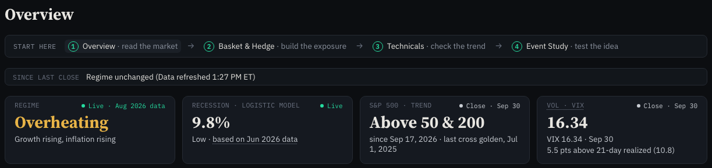 `02-overview-top.png` (no line under the title; the since line; the four tiles) · `02-overview-since-line.png` · `02-overview-regime-tile.png` · `02-overview-vix-tile.png` |
| 2d hover | 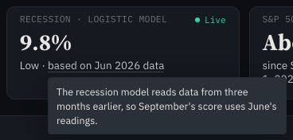 `02-overview-recession-hover.png` |
| 2f | 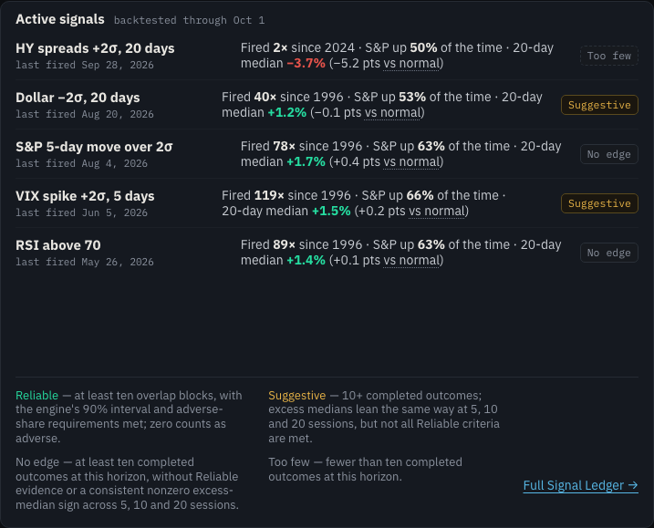 `02-overview-active-signals.png` |
| 2g | 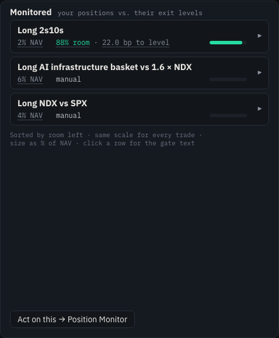 `02-overview-monitored.png` · `07-overview-monitored-room-hover.png` |
| 3a | 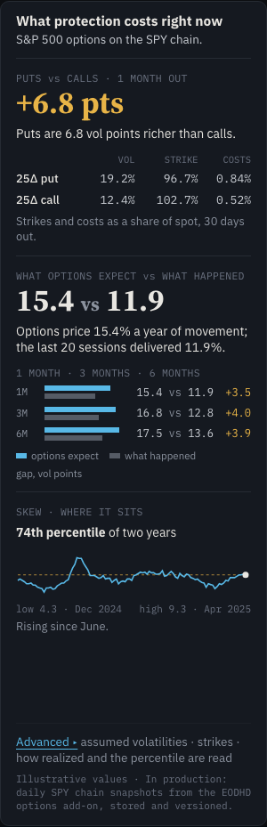 `03-technicals-options-card.png` |
| 3b | `03-technicals-signals-collapsed.png` · 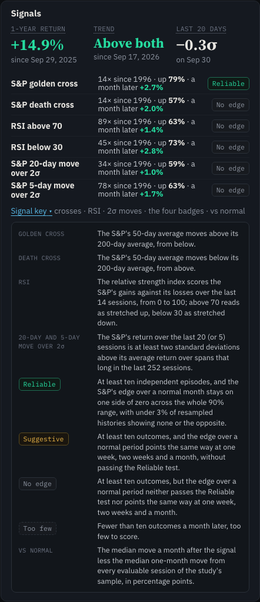 `03-technicals-signals-key-open.png` · `07-technicals-signals-column-hover.png` |
| 3c | 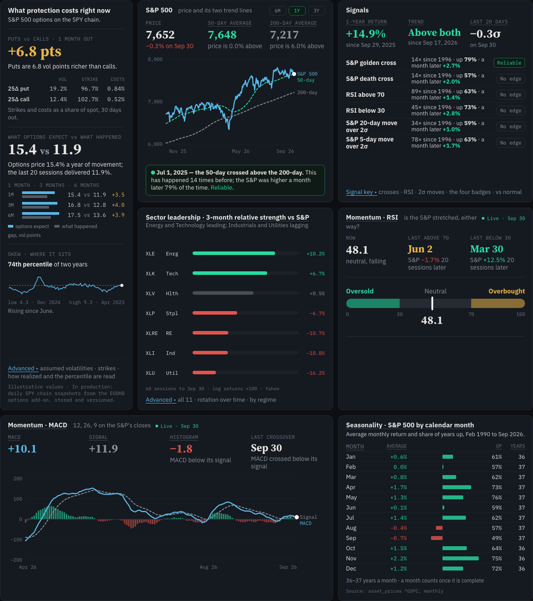 `03-technicals-grid-1440.png` · `03-technicals-grid-390.png` (phone, full page) · `07-technicals-seasonality-hover.png` |
| 4 | 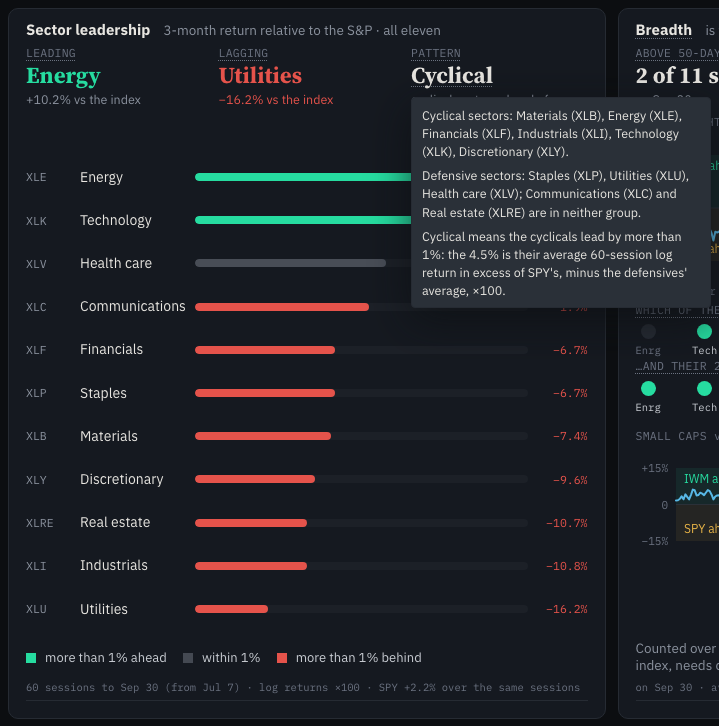 `04-sectors-pattern-hover.png` · `07-sectors-pattern-label-hover.png` · `07-sectors-breadth-label-hover.png` |
| 5 | 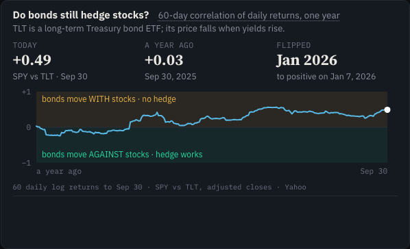 `05-macro-stock-bond.png` |
| 6 | 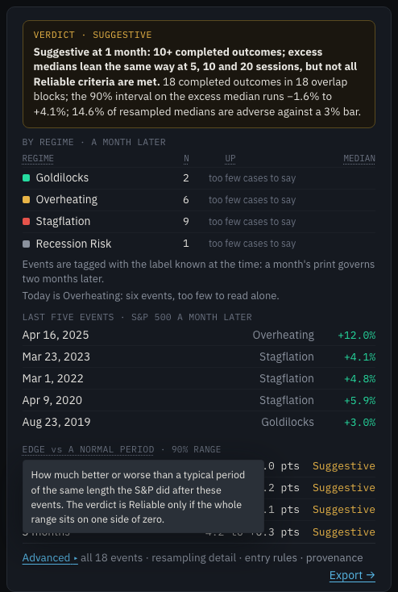 `06-event-study-edge-hover.png` · `07-event-study-by-regime-hover.png` |
| 7 | `07-basket-legs-hover.png` · `07-basket-against-hover.png` · `07-basket-liquidity-hover.png` · `07-basket-hedge-etf-hover.png` · `07-basket-stress-hover.png` · `07-ledger-vs-normal-hover.png` · `07-position-monitor-nav-hover.png` · `07-position-monitor-closed-hover.png` · `07-macro-matrix-tlt-hover.png` · `07-regime-table-hover.png` · `07-pipeline-hover.png` |

## Gates

| Gate | Tree | Result |
|---|---|---|
| Scoped tests per commit | each commit | item 1: shell + fresh-state, 163 passed; groundwork: `Term.test.tsx` 9; item 2: Overview, kit, Pipeline, sections, notes, 122; items 3–6: Technicals 44, Sectors 18, Macro 58, Event Study 71; item 7: every Desk file, 712; tsc clean before each commit |
| Web gate: `tsc -b --noEmit`, `vitest run`, `vite build` | `33a075ca` | tsc clean; **vitest 1,819 passed (147 files)**; build ✓ |
| Desk e2e: `e2e/desk.spec.ts` + `e2e/desk-usability.spec.ts`, `--workers=1`, my Vite on :5173 (stamp checked), fixtures routed in-page | `33a075c` | **84 passed** (the 83 before this branch, plus its keyboard-and-tap test), 4.7 min |
| Python tests that read files this branch changed (`test_web_fresh_report.py`, `test_desk_contract.py`, `test_desk_v2_envelope.py`, `test_desk_v2_study.py`, `test_desk_v2_pipeline.py`) | `git archive` of `33a075c` with a scratch DB copy (`MRR_WEB_NODE_MODULES` set to this worktree's) | **250 passed, 2 skipped** (`desk_scratch.db` is not in an archive tree; the audit's copy is not this store) |

The first full Desk e2e run, at item 7's first commit, was 82 passed and 1 failed: the null-answer test listed "From 1-year high", the label of the card item 3c removed. That list now names the Signals card's "1-year return", folded into item 3's commit. The non-Desk e2e suites were not run. Item 1's string is pinned in `e2e/accuracy-iteration.spec.ts`, which was updated to the new words. It was not run in this round, but was in the Follow-up below: its A3d check of the banner passes on all 8 routes.

## Not done, and the owner's calls

Items 1, 2, 3 and 5 below were decided by the owner after this report; see the Follow-up section at the end.

1. A stock's Technicals page keeps its Risk card (decision 9). **Decided: keep it.**
2. The Position Monitor page's Monitored card still reads "how far each is from being wrong · live" (decision 6). **Decided: the Overview's words, without "· live"; done in `c71f1b4e`.**
3. The served options card (not shown while `vol` is deferred) says "more expensive", not "richer" (decision 7). **Decided: "richer" / "cheaper"; done in `c71f1b4e`.**
4. The VIX tile's live-quote stamp is the tape's, ET on a 24-hour clock (decision 3).
5. The PROTOTYPE cards' tables have no column hovers (decision 13). **Decided: leave them.**
6. The Signal Ledger's own footnote "vs normal compares each study to its own baseline over its own sample." is unchanged; item 3b named only the Technicals card's box.

## Processes this session started, and stopped

- Local API, `uvicorn api.main:app` on 127.0.0.1:8000, run twice from a `git archive` tree in the scratchpad (the first stopped at its 30-minute background limit). Stopped at the end.
- Vite dev server on 127.0.0.1:5173, started three times (restarted so the build stamp named each new HEAD). Stopped at the end.
- No other process was started, stopped, restarted or reused. Ports 8001 and 5174 were never contacted, and a Vite on :5194 belonging to another job was left alone.
- `web/node_modules` was installed in this worktree (`npm ci`; gitignored). No `.env` or key was copied in.
- `CLAUDE.md` was not changed, per the brief. The shared stash holds an entry named "CLAUDE.md area-notes split, not part of desk/pdf-polish" that predates this session; it was not touched. For a later CLAUDE.md pass: Desk terms are Tab stops and tappable (`kit/Term.tsx`), column heads take their sentence by glossary id (`col-*`, `mx-*`), and every Desk clock is New York time (`format.ts` `etTime`, `etDayTime`).

## Follow-up: the owner's decisions on the open calls

**New HEAD after the follow-up: `c71f1b4e`** (one commit on `6cd184a0`, "fix(desk): the owner's calls on the open items: Monitored's small text, "richer" when options are served"). This section is the commit after it (docs only). Not pushed. Roll back with `git revert c71f1b4e` (web only).

| # | Decision | What was done |
|---|---|---|
| 1 | 3c: keep the Risk card on a single stock's Technicals page (`?symbol=`); it stays off the S&P view | No code change: the card renders only on a stock's page (`TechnicalsPage.tsx:918`). On the S&P's page, the grid places its seven cards (`TechnicalsPage.test.tsx`, "desk/pdf-polish 3c"). Recorded here as the owner's decision, not an open call. |
| 2 | 2g: the Position Monitor's Monitored card takes the Overview's small text; "· live" only if its values update from live quotes | The values are stored data, so "· live" is dropped. `useLevels` (`positions/usePositionStore.ts:35-41`) reads `/api/desk/technicals` and `/api/desk/macro`. `levelsFrom` (`positions/monitor.ts:29-38`) takes the S&P's newest stored close (`price`, `date`) and `/macro`'s 2s10s (`curve["2s10s_bp"]`). Both are plain Desk queries (`data/api.ts:246-256`, stale after 60 s, refetched on a new visit or with the generation), and none reads the relay's quotes: `useQuotes` is read on the Desk only by the Overview's VIX tile. Before: "how far each is from being wrong · live". After: "your positions vs. their exit levels" (`PositionMonitorPage.tsx:194`). |
| 3 | The options card once option data is live: "more expensive" → "richer" ("cheaper" for the opposite) | One sentence, `putsVsCalls` (`kit/format.ts:48-53`), now printed by both states: served (`TechnicalsPage.tsx:104`) and PROTOTYPE (`prototypes/ProtectionCard.tsx:125`). Before, served: "Puts are 6.8 vol points more expensive than calls." / "Calls are N vol points more expensive than puts.". After, both states: "Puts are 6.8 vol points richer than calls." / "Puts are N vol points cheaper than calls." (zero reads "richer", as the PROTOTYPE did). |
| 4 | Leave the PROTOTYPE cards' tables without hovers | No change. |
| 5 | Run `e2e/accuracy-iteration.spec.ts` if it can run without the EODHD key or a `.env` | It runs without the key or a `.env`: **35 of 38 pass**, every A3 freshness test among them. That includes A3d, which pins item 1's banner, "Most recent stored close: Sep 14", on all 8 routes. It needs: the Vite dev server (`E2E_BASE_URL`), and the API on :8000 serving a populated store with its rate limits raised, run alone. Here that was a `git archive` of the commit with a scratch copy of `data/macro_radar.db` and `RATE_LIMIT_PER_CLIENT_PER_MIN`, `_BURST`, `RATE_LIMIT_GLOBAL_PER_MIN`, `_BURST` = 100000. The three failures: **A2** needs the EODHD relay. With `EODHD_API_TOKEN` in the API's environment (or the repo-root `.env` the API reads), the relay serves the delayed VIX quote, and the Dashboard's VIX card prints it as `data-metric="vix-live"` (`dashboard/KeyLevels.tsx:131`). Without it: `vix-live: no [data-metric="vix-live"] on any view`. **A1 /app/methodology at 1672 and at 390** fail on the base too, with or without the key. The page's "Standard methods" section says "temperature 0.7" (`methodology/MethodologyScreen.tsx:630`, added by fix/freshness `d1e73a64`, on `main` before this branch), and the spec counts any number without a nearby `[data-stamp]` as an unstamped card. This branch changes no Methodology or stamp file. Giving that section a stamp, or exempting reference text from A1, is the owner's call; neither was done here. |

Screenshots at 1440 px, stamp `desk/pdf-polish@c71f1b4`: `shots/desk-pdf-polish/08-followup-position-monitor-monitored.png` (tonight's data, positions from the fixtures' browser store) and `shots/desk-pdf-polish/08-followup-options-card-served.png`. The second shows the card as served, from the §12 fixtures with `/technicals`' `vol` block served (`src/test/desk-variants.ts` `servedTechnicals`), because tonight's API defers it.

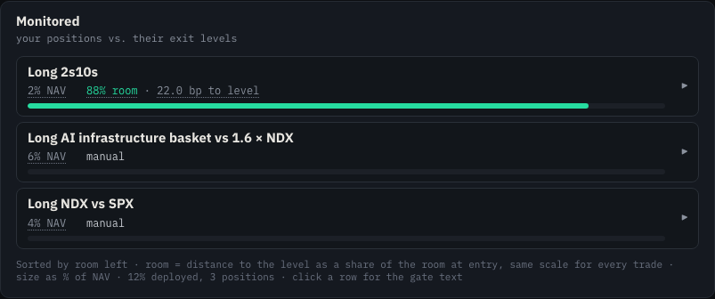

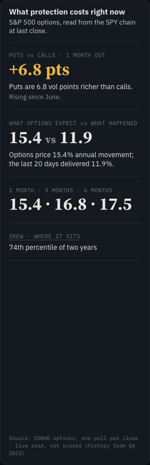

### Follow-up gates (at `c71f1b4e`)

| Gate | Result |
|---|---|
| Scoped: Technicals, Position Monitor, prototypes, kit, the ban list, column heads | 26 files, **248 passed** |
| Web gate: `tsc -b --noEmit`, `vitest run`, `vite build` | tsc clean; **vitest 1,820 passed (147 files)**, the new `putsVsCalls` test included; build ✓. The first full run had one failure: `BasketHedgePage.test.tsx` "Codex R-04 … ten NVDA legs" ran 7.2 s against vitest's 5 s limit under the full suite's load. The file passed alone twice (40 of 40) and in a second full run; this commit touches nothing it renders. |
| Desk e2e: `e2e/desk.spec.ts` + `e2e/desk-usability.spec.ts`, my Vite on :5173 (stamp `desk/pdf-polish@c71f1b4`) | **84 passed**, 4.8 min |
| `e2e/accuracy-iteration.spec.ts`, alone, my Vite on :5173 (stamp `desk/pdf-polish@c71f1b4`) and my API on :8000, no key | **35 passed, 3 failed** (1.9 min): A2 needs the EODHD relay (`vix-live`); A1 Methodology at 1672 and 390 fails on the base too ("temperature 0.7", no stamp). Decision 5 has the detail. |

Servers: my API on :8000 (a `git archive` of `c71f1b4e`, a scratch DB copy, no keys, the rate limits raised for the run) and my Vite on :5173 were started for these gates and stopped afterwards. Nothing else was started, stopped or reused.

## Codex round 1

Codex reviewed the branch at `365290ec` and the owner answered each finding. The brief gave the owner's instruction for each finding but not Codex's text; the IDs and the wording below are the owner's. **Code HEAD after the fixes: `0bdd8e38`** (12 commits on `365290ec`, one per finding). This section is the commit after it (docs only). Not pushed. Every fix is web only: no model, coefficient, threshold, stored-history or API change, and `api/stream.py` is untouched. Roll back any one with `git revert <commit>`.

| ID | The owner's instruction | What was done | Commit |
|---|---|---|---|
| R-01 | "Backtested through" names the last session the studies' data covers, from a served field, never the staging date; else "data through" a served close date, else no date | `activeSignalsWords` (`overview/OverviewPage.tsx:277`) takes the earliest `evaluated_on` among the served `active_signals` rows (`api/desk_v2.py:455`; the date every row's data reaches), so the line is true of each row. With no row dated, it prints "data through" the S&P trend tile's close date (`tiles.trend.date`, `api/desk_v2.py:425-430`); with neither, no date. Test: a fixture staged Sep 24 with rows evaluated Sep 23 and Sep 21 prints "backtested through Sep 21". | `e0209d7d` |
| R-02 | RSI is Wilder-smoothed with a 14-session period, not a 14-session window | `glossary.ts:24` and the Signal key (`technicals/signal-key.ts:32`): "weighs Wilder-smoothed average gains against average losses with a 14-session period" (`src/analytics/technicals.py` `rsi`). Tests pin both. | `6ec8dc2f` |
| R-03 | The Vol cut definition matches the sign the column shows; the number unchanged | `glossary.ts:86`: "vol left over the basket's own volatility, minus one, so −44% means 44% less". The column prints `pct(−vol_reduction)` (`basket/BasketHedgeStep.tsx`), `vol_reduction = 1 − resid/vol` (`src/desk/basket.py`). Test: the cells start with "−" and the definition says the same sign. | `270cdce2` |
| R-04 | N, Up, Median and the other outcome definitions count from each event's entry, which follows the inputs' availability rule (read from the code) | The outcome heads now say "from each event's entry": Event Study's N, Up, Median (`glossary.ts:111-113`) and its four horizon columns (`:115-118`), the Ledger's Times, Up a month later, Median (`:126-128`). Each of those heads, and the Ledger's Vs normal, adds two shared sentences (`StudyRail.tsx:34`, `EngineDetail.tsx:54`, `LedgerPage.tsx:38,248`). `entry` (`glossary.ts:121`): "the first [session] whose target value is fixed no earlier than every input is known, and for a gold target the next at the earliest" (`src/desk/event_study.py:576-599` `entry_delay_vec`; `defer_as_target` in `src/desk/series.py`). `entry-rule` (`:122`): "For an S&P target, a signal on S&P closes enters on its own session, one on FRED, VIX, dollar or gold data the next, and one on weekly WTI the eighth". Read from `series.py` `SERIES`: the S&P fixed and known at the close; FRED known at the next open; the VIX at 16:15; gold and the dollar at 17:00; WTI at 13:00 on the eighth business day. The Signal key's "Too few" counts from the firing's close (`signal-key.ts:37`): every Technicals row reads only the S&P, so its entry is its own session. | `4d95ad5b` |
| R-05 | "Vs normal" is the difference in median log returns ×100 (bp for yield targets), in plain words | A new `vsnormal` entry (`glossary.ts:38`) takes the "vs normal" forms: "the difference between the events' median log return and the same horizon's median from every evaluable session, times 100, or in basis points for a yield or spread". It matches `api/desk_v2.py:762-766` `vs_normal`, which is 100 × Δ for a log unit and Δ in bp for bp. `baseline` keeps "a normal stretch" (`:36`). The Ledger's head (`:129`) and the Signal key (`signal-key.ts:38`) say the same. The Overview's "vs normal" shows the difference, then what normal is (`OverviewPage.tsx:318`). | `10b87069` |
| R-06 | "Current" means within the series' allowed publication lag; state the lag rule from the code | Status (`glossary.ts:166`): "current when the newest stored observation is within the series' allowed publication lag, stale when further behind, and missing when nothing is stored or its date is unknown". It adds the three rules `api/desk_pipeline.py:287` `statuses` applies (`PipelinePage.tsx:30,132`; `glossary.ts:167-172`). First, the price history's closes: current for the last completed session, or the one before until 06:00 UTC the next day (`api/freshness.py:315,332-333`), said in ET per D1 as 2 AM ET (1 AM in winter). Second, every other daily series: within three business days of the previous business day's print, on the bond calendar for rates and spreads (`DAILY_TOLERANCE`, `fred_series_state`, `desk_series_states`), and weekly WTI within eight (`DESK_SLOW_PUBLICATION`). Third, a monthly series: when it holds the newest month whose usual release day has passed (`_expected_month_for`, `SERIES_REGISTRY`'s release days). | `1600f6ce` |
| R-07 | Leading and Lagging are among the sectors with usable returns, not "of the eleven" | `glossary.ts:103-104`: "among the sectors with a usable return, a close stored at both ends of the window" (`api/desk_items_etf.py:197-231` ranks only the sectors whose 60-session log return exists). | `2818b2d2` |
| R-08 | The hedge fit uses the last 252 paired daily returns, or 60 when the longer fit is not available; each row shows its basis | `hedgeratio` (`glossary.ts:55`): "over the last 252 daily returns both have, else the last 60". Vol left says it is over the row's Fit window (`:85`). The ETF table gains a **Fit** column (`BasketHedgeStep.tsx:55,76,102`), 1Y, 60D or —, from each row's served `basis` (`src/desk/basket.py:332,439-447`), with its own definition (`glossary.ts:84`). Test: a 60-return row prints 60D and a row with neither prints —. | `a6108be2` |
| R-09 | Neutral wording for the edge, in the target's unit; this replaces the owner's item-6 wording | `edgeDef` (`StudyRail.tsx:28-31`): "The difference between the S&P's median move after these events and its median over a typical period of the same length, in the S&P's unit (log returns ×100 for prices, basis points for yields and spreads)." The target is read from the study, as before. Two conservative choices: the owner's "percent" is written "log returns ×100", the unit the range prints and R-05's; "yields" is written "yields and spreads", since a spread can be a target. Item 6's second sentence ("The verdict is Reliable only if …") went with the wording it replaced. | `9c08ba4f` |
| R-10 | Tapping a definition must not activate the row around it | `TermTip` remembers the term a touch or pen pointer went down on. In the capture phase it stops the click that follows when that term sits inside a control (`kit/Term.tsx:227-250`). The controls are the Ledger rows, the monitored positions' buttons and Basket & Hedge's Notional label. A tap shows the sentence and opens nothing. A tap elsewhere in the row, the keyboard, and a mouse click still open it; a mouse shows the sentence on hover, so its click is taken as meant. A control taking the focus keeps the tapped term's sentence (`:202`). Tests: jsdom (`Term.test.tsx`), and the 390 px e2e below (a Ledger title tapped, the page stays; a date cell tapped, Event Study opens). | `0fd4c7c2` |
| R-11 | Measure the tooltip and keep it inside the viewport at 390 px; clamp the height and let it scroll; test at a phone width | `TermTip` renders the tip hidden and unclamped, measures it, and places it with `placeTip` (`kit/Term.tsx:139`). It goes under its term when it fits, else over it, else on the roomier side with its height clamped there (the sentences scroll in `.dk-term-tip-body`, `desk2.css:682`). It stays 8 px inside every edge, at most 300 px wide, less on a phone. The tip now takes the pointer so it can be scrolled. A strip over the gap (`desk2.css:670`), a finger inside it and its own scroll keep it open (`:190`). Tests: `placeTip` at 390 px, the pointer rules in jsdom, and the e2e `desk-usability.spec.ts:513` at 390 × 844 and 390 × 360. There, the Data Pipeline's four-sentence Status tip stays inside the window, its body overflows and scrolls, and it stays open. | `f6b6f22c` |
| R-12 | Deferred by the owner | Not done. The brief gives no text for it, and this session did not read Codex's own output (outside this folder), so it is listed by ID only. | — |
| R-13 | Pre-existing, fix it: the stock–bond chart's bands say what the sign means, not whether a hedge works | `macro/MacroPage.tsx:303-304`: "positive correlation: bonds move with stocks" and "negative correlation: bonds offset stocks", in place of "bonds move WITH stocks · no hedge" and "bonds move AGAINST stocks · hedge works". Colors unchanged. The card's title, the question "Do bonds still hedge stocks?", was not part of the finding and is unchanged. The labels fit the chart at 390, 768 and 1440 px, checked in a browser. | `0bdd8e38` |

Before → after, for the strings a reader sees:

| Where | Before | After |
|---|---|---|
| Overview, Active signals small text | backtested through Sep 24 (the generation's staging date) | backtested through Sep 21 (the earliest `evaluated_on`), or "data through Sep 23" |
| Event Study N / Up / Median | "… have an outcome 20 sessions later." / "… after which the target was higher 20 sessions later." / "… over the 20 sessions after those events." | "… have a complete 20-session outcome from their entry." / "… whose target was higher 20 sessions after entry." / "… over the 20 sessions from each event's entry.", each followed by the `entry` and `entry-rule` sentences |
| Ledger Vs normal | "… in percentage points, or bp for a yield." | "… in log returns times 100, or basis points for a yield or spread.", then `entry`, `entry-rule` |
| Data Pipeline Status | "current when the newest observation stored is the one due on the series' own schedule …" | the R-06 sentence and its three lag rules |
| Sectors Leading / Lagging | "…, of the eleven." | "…, among the sectors with a usable return, a close stored at both ends of the window." |
| Basket & Hedge hedge ratio | "… over one year, or 60 days when younger." | "… over the last 252 daily returns both have, else the last 60.", plus the Fit column |
| Event Study edge hover | "How much better or worse than a typical period of the same length the S&P did after these events. The verdict is Reliable only if the whole range sits on one side of zero." | "The difference between the S&P's median move after these events and its median over a typical period of the same length, in the S&P's unit (log returns ×100 for prices, basis points for yields and spreads)." |
| Macro, stock–bond bands | "bonds move WITH stocks · no hedge" / "bonds move AGAINST stocks · hedge works" | "positive correlation: bonds move with stocks" / "negative correlation: bonds offset stocks" |

### Round 1 gates (at `0bdd8e38`)

| Gate | Result |
|---|---|
| Scoped tests and `tsc` before each commit | R-01 to R-03 passed (their counts were not kept); R-04 8 files, 164 passed; R-05 18 files, 238 passed and 1 failed (the new test's own pattern, corrected), then `Term.test.tsx` 13; R-06 4 files, 44 (after one sentence was cut to the 32-word limit); R-07 4 files, 84; R-08 7 files, 97; R-09 4 files, 79; R-10 `Term.test.tsx` 15 and 11 page files, 183; R-11 `Term.test.tsx` 19 (after the jsdom test kept its `relatedTarget`) and the two phone e2e tests; R-13 2 files, 66 |
| Web gate: `tsc -b --noEmit`, `vitest run`, `vite build` | tsc clean; **vitest 1,831 passed (147 files)**; build ✓ |
| Desk e2e: `e2e/desk.spec.ts` + `e2e/desk-usability.spec.ts`, `--workers=1`, my Vite on :5173 (stamp `desk/pdf-polish@0bdd8e3`) | **85 passed** (the 84 before, plus the R-10/R-11 phone test), 5.0 min |
| Python tests that scan the web tree (`test_desk_v2_pipeline.py`, `test_env_template.py`, `test_desk_contract.py`) | `git archive` of `0bdd8e38` with a scratch DB copy: **147 passed, 2 skipped** |
| `e2e/accuracy-iteration.spec.ts` | Not rerun: this round changes nothing it reads (the banner, freshness stamps, Methodology). |

Servers for these gates: my Vite on :5173 (started for the R-11 e2e, restarted at `0bdd8e38` for the stamp). No API was needed, since the Desk e2e routes `/api/desk` in the page.
